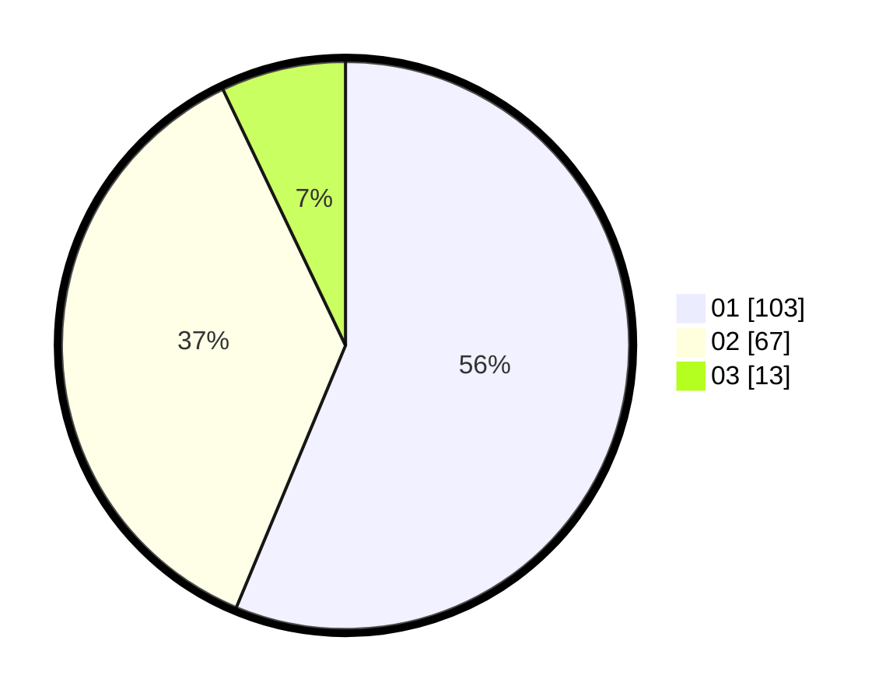

# Hasil

Hasil perolehan suara paslon dapat dilihat pada file paslon-01.txt, paslon-02.txt, dan paslon-03.txt.

Jika tidak ada, artinya data tersebut belum ada pada SIREKAP.

## Perolehan Suara

 * Paslon 01: **103**.
 * Paslon 02: **67**.
 * Paslon 03: **13**.

## Foto C Plano

https://sirekap-obj-formc.kpu.go.id/ded7/pemilu/ppwp/31/75/06/10/05/3175061005015-20240214-220040--ad2d0e33-83a1-4cdf-93c4-0457dcf47eed.jpg

https://sirekap-obj-formc.kpu.go.id/ded7/pemilu/ppwp/31/75/06/10/05/3175061005015-20240214-195032--aeb64d8d-c99a-4dc4-988c-6e6169cba30b.jpg
