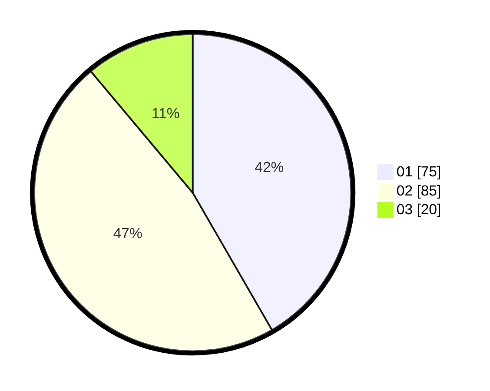

# Hasil

Hasil perolehan suara paslon dapat dilihat pada file paslon-01.txt, paslon-02.txt, dan paslon-03.txt.

Jika tidak ada, artinya data tersebut belum ada pada SIREKAP.

## Perolehan Suara

 * Paslon 01: **75**.
 * Paslon 02: **85**.
 * Paslon 03: **20**.

## Foto C Plano

https://sirekap-obj-formc.kpu.go.id/391d/pemilu/ppwp/31/75/06/10/05/3175061005029-20240214-222706--ae3e80f6-c5ab-4f43-b8e9-e890e35e6b41.jpg

https://sirekap-obj-formc.kpu.go.id/391d/pemilu/ppwp/31/75/06/10/05/3175061005029-20240214-224849--f5b7079e-cca4-4db0-83fd-736a01adedda.jpg

https://sirekap-obj-formc.kpu.go.id/391d/pemilu/ppwp/31/75/06/10/05/3175061005029-20240214-224944--af38b5c8-cca6-4d79-8e5d-e85a0416cb79.jpg
