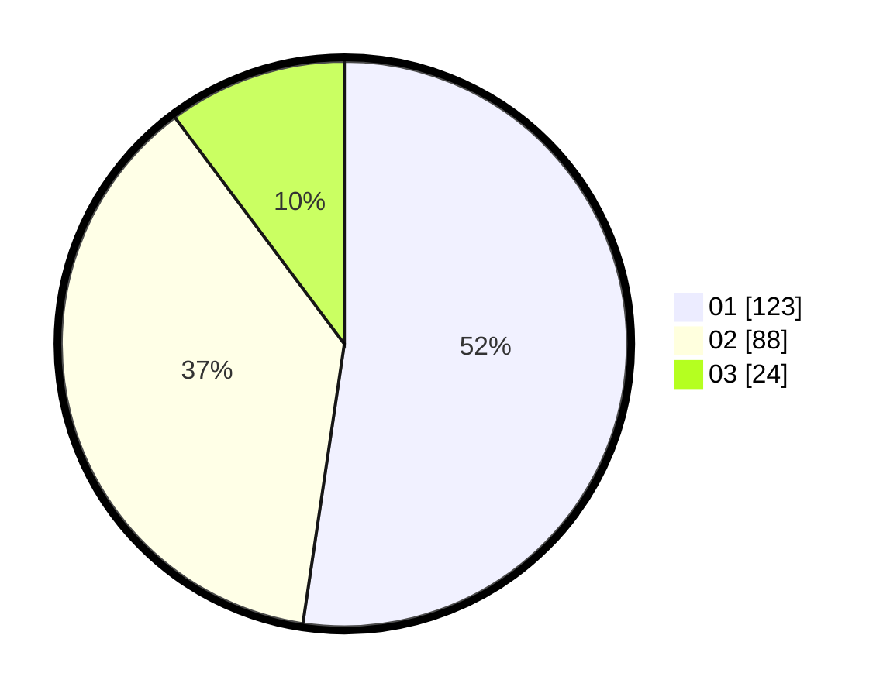

# Hasil

Hasil perolehan suara paslon dapat dilihat pada file paslon-01.txt, paslon-02.txt, dan paslon-03.txt.

Jika tidak ada, artinya data tersebut belum ada pada SIREKAP.

## Perolehan Suara

 * Paslon 01: **123**.
 * Paslon 02: **88**.
 * Paslon 03: **24**.

## Foto C Plano

https://sirekap-obj-formc.kpu.go.id/dbb6/pemilu/ppwp/31/75/06/10/05/3175061005032-20240214-225547--b1157534-b517-4384-a4d7-3ca0a786a162.jpg

https://sirekap-obj-formc.kpu.go.id/dbb6/pemilu/ppwp/31/75/06/10/05/3175061005032-20240214-225922--b6668fd1-8d2c-4f72-81e4-356952902132.jpg

https://sirekap-obj-formc.kpu.go.id/dbb6/pemilu/ppwp/31/75/06/10/05/3175061005032-20240214-230119--be3dfa08-ee8e-4acd-b045-18a8a447e93e.jpg
