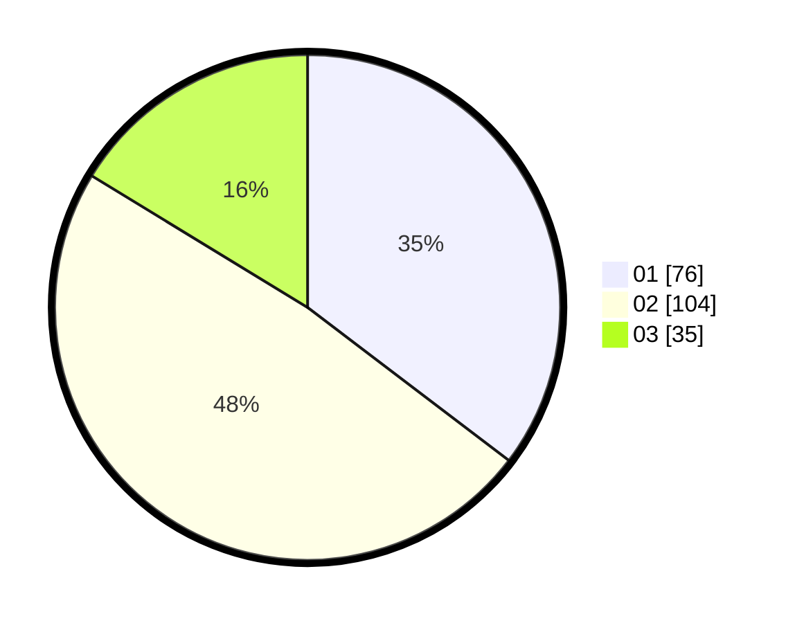

# Hasil

Hasil perolehan suara paslon dapat dilihat pada file paslon-01.txt, paslon-02.txt, dan paslon-03.txt.

Jika tidak ada, artinya data tersebut belum ada pada SIREKAP.

## Perolehan Suara

 * Paslon 01: **76**.
 * Paslon 02: **104**.
 * Paslon 03: **35**.

## Foto C Plano

https://sirekap-obj-formc.kpu.go.id/e0c9/pemilu/ppwp/31/75/06/10/05/3175061005056-20240214-205730--c054ed41-fc97-4db7-a622-7dc67eb03478.jpg

https://sirekap-obj-formc.kpu.go.id/e0c9/pemilu/ppwp/31/75/06/10/05/3175061005056-20240214-210044--0f145cc7-dbdf-4561-9ecc-b00d8f6a44ec.jpg

https://sirekap-obj-formc.kpu.go.id/e0c9/pemilu/ppwp/31/75/06/10/05/3175061005056-20240214-203438--d12f1b94-0f3e-43a9-8bc1-ab0736ed8ed7.jpg
