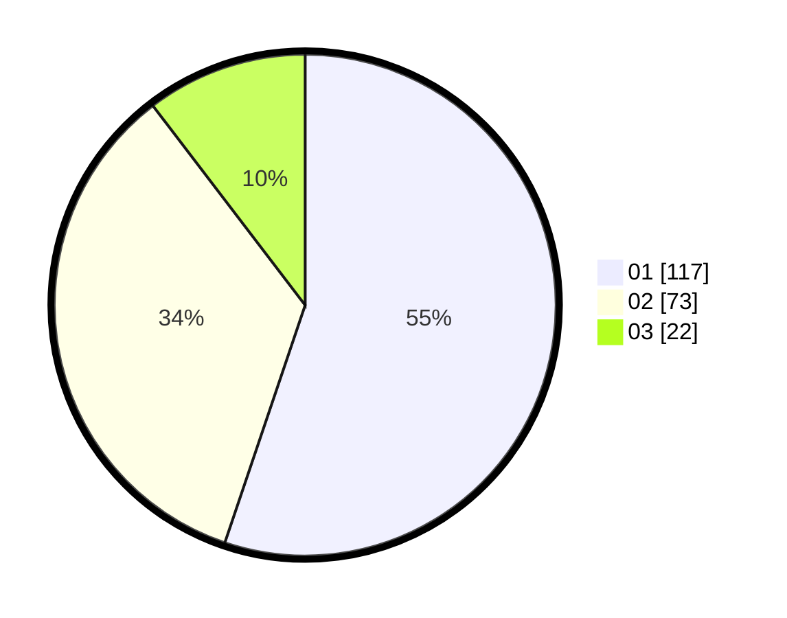

# Hasil

Hasil perolehan suara paslon dapat dilihat pada file paslon-01.txt, paslon-02.txt, dan paslon-03.txt.

Jika tidak ada, artinya data tersebut belum ada pada SIREKAP.

## Perolehan Suara

 * Paslon 01: **117**.
 * Paslon 02: **73**.
 * Paslon 03: **22**.

## Foto C Plano

https://sirekap-obj-formc.kpu.go.id/442c/pemilu/ppwp/31/75/06/10/05/3175061005069-20240214-225714--b80f4c33-bfcc-4579-81b8-cbe09fdfaede.jpg

https://sirekap-obj-formc.kpu.go.id/442c/pemilu/ppwp/31/75/06/10/05/3175061005069-20240214-225814--10735c97-c6af-4244-be8e-769322510205.jpg

https://sirekap-obj-formc.kpu.go.id/442c/pemilu/ppwp/31/75/06/10/05/3175061005069-20240214-225921--44ecfa3f-1a11-45c2-9d9f-fc644911b44e.jpg
