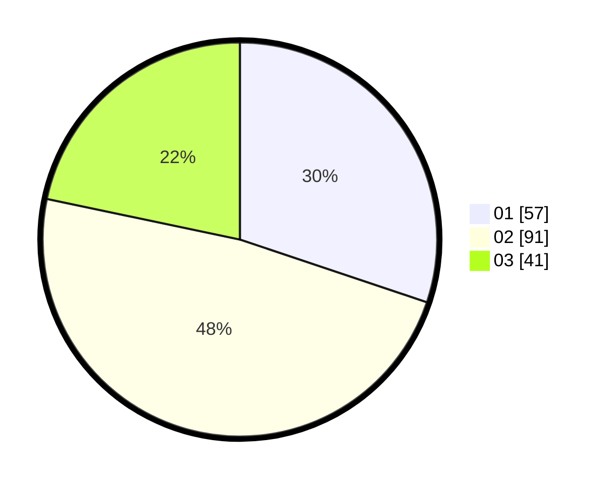

# Hasil

Hasil perolehan suara paslon dapat dilihat pada file paslon-01.txt, paslon-02.txt, dan paslon-03.txt.

Jika tidak ada, artinya data tersebut belum ada pada SIREKAP.

## Perolehan Suara

 * Paslon 01: **57**.
 * Paslon 02: **91**.
 * Paslon 03: **41**.

## Foto C Plano

https://sirekap-obj-formc.kpu.go.id/ae6c/pemilu/ppwp/31/75/06/10/05/3175061005080-20240214-194430--828bdc75-fe47-4504-ab11-10caa581333d.jpg

https://sirekap-obj-formc.kpu.go.id/ae6c/pemilu/ppwp/31/75/06/10/05/3175061005080-20240214-194128--44b060f9-d306-4255-9257-e60b32a410b0.jpg

https://sirekap-obj-formc.kpu.go.id/ae6c/pemilu/ppwp/31/75/06/10/05/3175061005080-20240214-194954--1a48679d-d140-4a6b-a386-6b174371461c.jpg

## DATA PEMILIH TETAP

Jumlah pemilih dalam DPT: **286**.
 * L: **144**.
 * P: **142**.

## DATA PENGGUNA HAK PILIH

Jumlah pengguna hak pilih dalam DPT: **191**.
 * L: **91**.
 * P: **100**.

Jumlah pengguna hak pilih dalam DPTb: **0**.
 * L: **0**.
 * P: **0**.

Jumlah pengguna hak pilih dalam DPK: **3**.
 * L: **1**.
 * P: **2**.

Jumlah pengguna hak pilih: **194**.
 * L: **92**.
 * P: **102**.

## JUMLAH SUARA SAH DAN TIDAK SAH

JUMLAH SELURUH SUARA SAH: **189**.

JUMLAH SUARA TIDAK SAH: **5**.

JUMLAH SELURUH SUARA SAH DAN SUARA TIDAK SAH: **194**.
