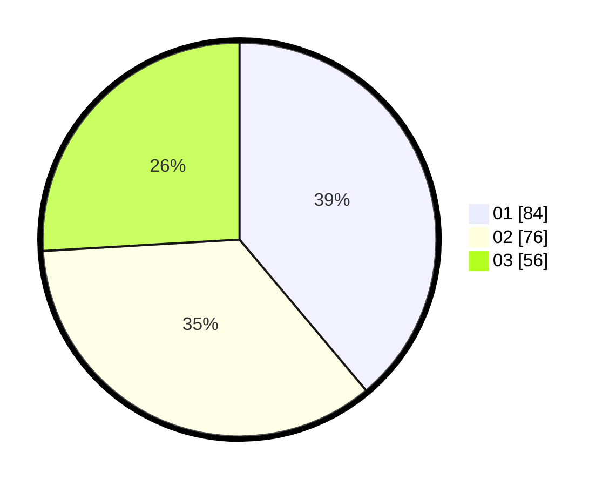

# Hasil

Hasil perolehan suara paslon dapat dilihat pada file paslon-01.txt, paslon-02.txt, dan paslon-03.txt.

Jika tidak ada, artinya data tersebut belum ada pada SIREKAP.

## Perolehan Suara

 * Paslon 01: **84**.
 * Paslon 02: **76**.
 * Paslon 03: **56**.

## Foto C Plano

https://sirekap-obj-formc.kpu.go.id/b4a1/pemilu/ppwp/31/75/06/10/05/3175061005082-20240215-004440--faab6522-583a-4abd-9885-a92696c7d61a.jpg

https://sirekap-obj-formc.kpu.go.id/b4a1/pemilu/ppwp/31/75/06/10/05/3175061005082-20240215-004536--1b9a082b-5d1b-4b22-8163-d5aa4eafdb73.jpg

https://sirekap-obj-formc.kpu.go.id/b4a1/pemilu/ppwp/31/75/06/10/05/3175061005082-20240215-005639--921561f2-d504-4758-a7e8-19dfeb969ac8.jpg
