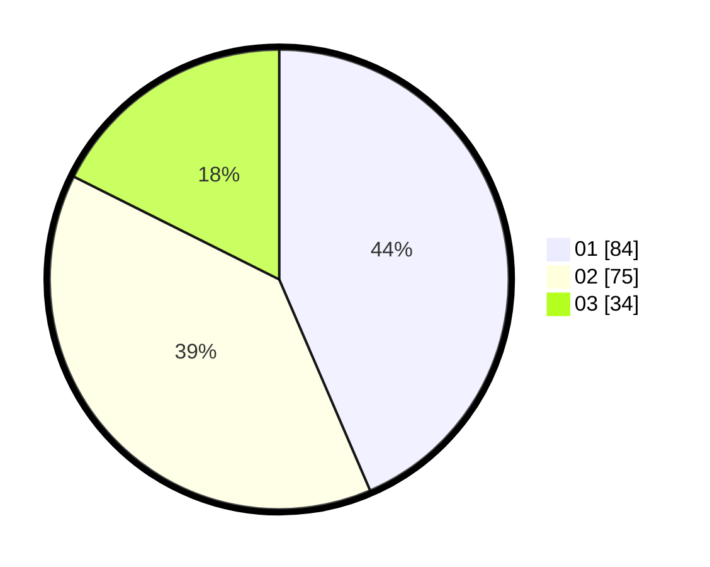

# Hasil

Hasil perolehan suara paslon dapat dilihat pada file paslon-01.txt, paslon-02.txt, dan paslon-03.txt.

Jika tidak ada, artinya data tersebut belum ada pada SIREKAP.

## Perolehan Suara

 * Paslon 01: **84**.
 * Paslon 02: **75**.
 * Paslon 03: **34**.

## Foto C Plano

https://sirekap-obj-formc.kpu.go.id/6298/pemilu/ppwp/31/75/06/10/05/3175061005084-20240214-191500--78e36955-d372-46b7-807d-cfd1b33f1e5e.jpg

https://sirekap-obj-formc.kpu.go.id/6298/pemilu/ppwp/31/75/06/10/05/3175061005084-20240214-191508--d0011ab1-8d10-4c79-93b2-979b26d7e0f5.jpg

https://sirekap-obj-formc.kpu.go.id/6298/pemilu/ppwp/31/75/06/10/05/3175061005084-20240214-191453--fe1f7007-47ce-410d-b82d-3152f3ccf0be.jpg
