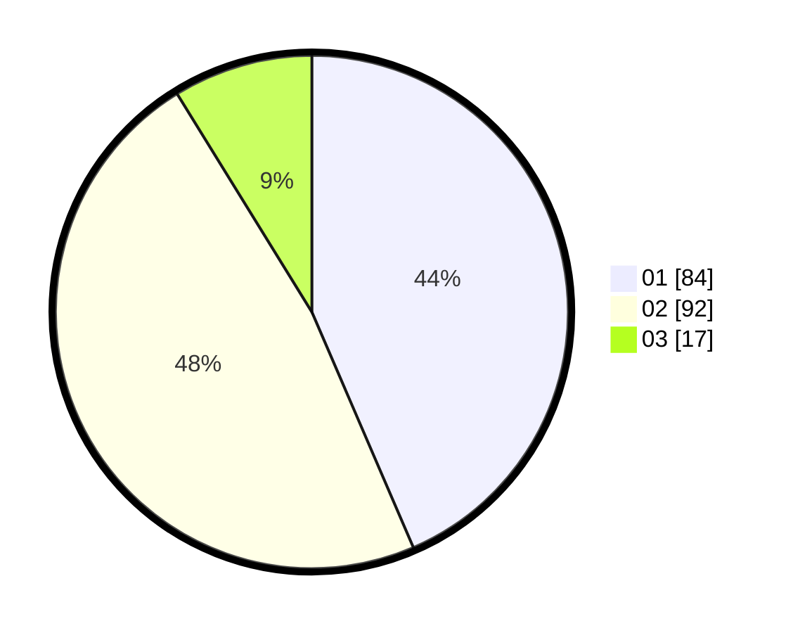

# Hasil

Hasil perolehan suara paslon dapat dilihat pada file paslon-01.txt, paslon-02.txt, dan paslon-03.txt.

Jika tidak ada, artinya data tersebut belum ada pada SIREKAP.

## Perolehan Suara

 * Paslon 01: **84**.
 * Paslon 02: **92**.
 * Paslon 03: **17**.

## Foto C Plano

https://sirekap-obj-formc.kpu.go.id/584f/pemilu/ppwp/31/75/06/10/05/3175061005087-20240214-221801--470c758f-dd79-4f69-8d0c-1578f7e99bce.jpg

https://sirekap-obj-formc.kpu.go.id/584f/pemilu/ppwp/31/75/06/10/05/3175061005087-20240214-221829--1f1b4fbc-5885-40ed-84fd-5a83ab60cf3b.jpg

https://sirekap-obj-formc.kpu.go.id/584f/pemilu/ppwp/31/75/06/10/05/3175061005087-20240214-221920--6b6ca061-8c5e-4ce6-a9b5-5f6a0fbb30e7.jpg
