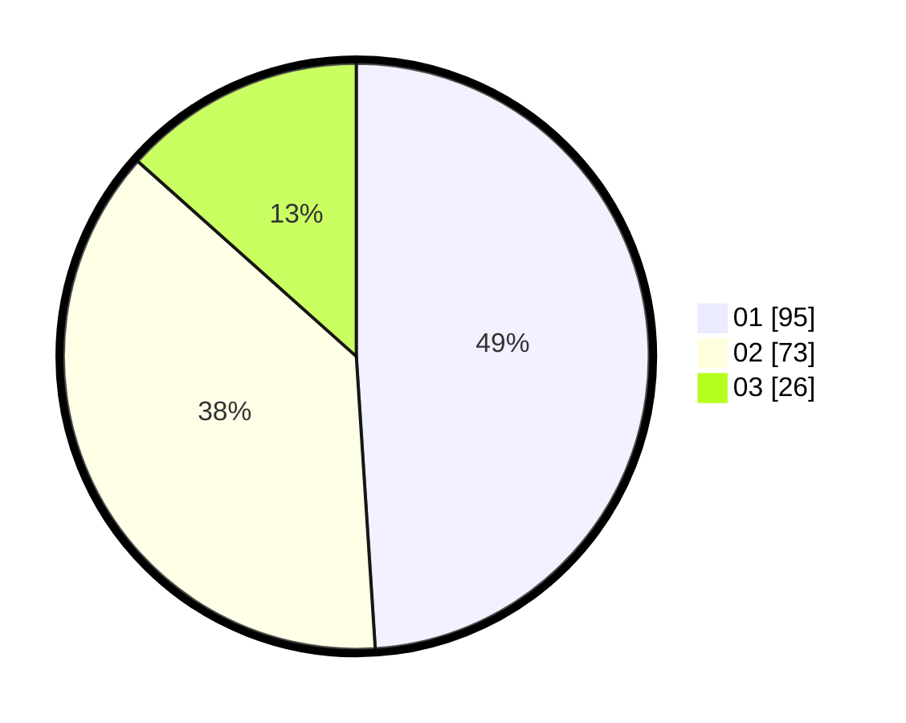

# Hasil

Hasil perolehan suara paslon dapat dilihat pada file paslon-01.txt, paslon-02.txt, dan paslon-03.txt.

Jika tidak ada, artinya data tersebut belum ada pada SIREKAP.

## Perolehan Suara

 * Paslon 01: **95**.
 * Paslon 02: **73**.
 * Paslon 03: **26**.

## Foto C Plano

https://sirekap-obj-formc.kpu.go.id/803b/pemilu/ppwp/31/75/06/10/05/3175061005091-20240214-194613--9c2ee6fd-89af-46c1-bfbb-e560b0a9386b.jpg

https://sirekap-obj-formc.kpu.go.id/803b/pemilu/ppwp/31/75/06/10/05/3175061005091-20240214-194620--03eb1025-8d28-42ab-8149-9d3980c945e6.jpg

https://sirekap-obj-formc.kpu.go.id/803b/pemilu/ppwp/31/75/06/10/05/3175061005091-20240214-194626--5461fbc7-f32a-4108-bbbb-df02aac0828e.jpg

## DATA PEMILIH TETAP

Jumlah pemilih dalam DPT: **277**.
 * L: **138**.
 * P: **139**.

## DATA PENGGUNA HAK PILIH

Jumlah pengguna hak pilih dalam DPT: **194**.
 * L: **91**.
 * P: **103**.

Jumlah pengguna hak pilih dalam DPTb: **0**.
 * L: **0**.
 * P: **0**.

Jumlah pengguna hak pilih dalam DPK: **1**.
 * L: **1**.
 * P: **0**.

Jumlah pengguna hak pilih: **195**.
 * L: **92**.
 * P: **103**.

## JUMLAH SUARA SAH DAN TIDAK SAH

JUMLAH SELURUH SUARA SAH: **194**.

JUMLAH SUARA TIDAK SAH: **1**.

JUMLAH SELURUH SUARA SAH DAN SUARA TIDAK SAH: **195**.
