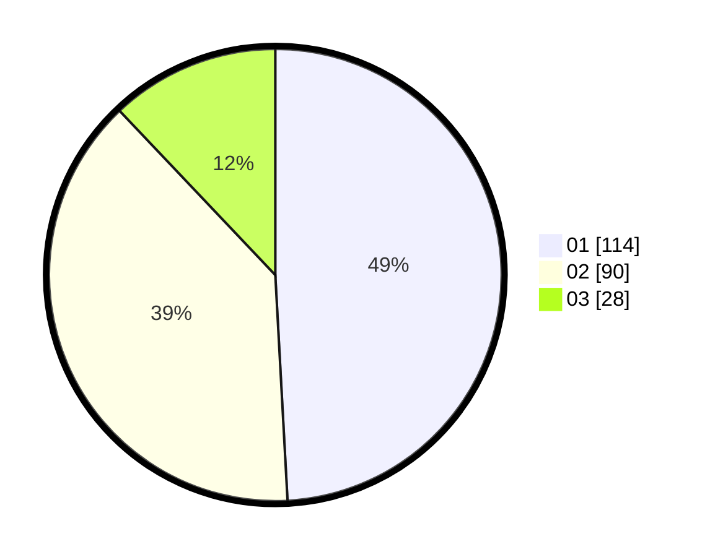

# Hasil

Hasil perolehan suara paslon dapat dilihat pada file paslon-01.txt, paslon-02.txt, dan paslon-03.txt.

Jika tidak ada, artinya data tersebut belum ada pada SIREKAP.

## Perolehan Suara

 * Paslon 01: **114**.
 * Paslon 02: **90**.
 * Paslon 03: **28**.

## Foto C Plano

https://sirekap-obj-formc.kpu.go.id/f6c0/pemilu/ppwp/31/75/06/10/05/3175061005092-20240214-203432--02496bc8-f2f7-4c35-9576-1b98fb67c644.jpg

https://sirekap-obj-formc.kpu.go.id/f6c0/pemilu/ppwp/31/75/06/10/05/3175061005092-20240214-203513--939e115e-786d-4018-8219-53761f7ea6aa.jpg

https://sirekap-obj-formc.kpu.go.id/f6c0/pemilu/ppwp/31/75/06/10/05/3175061005092-20240214-203604--7255667c-4e90-4644-8ed0-a2feadce0914.jpg
