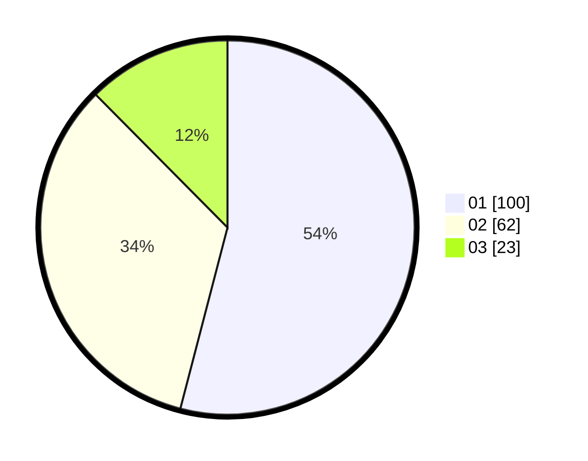

# Hasil

Hasil perolehan suara paslon dapat dilihat pada file paslon-01.txt, paslon-02.txt, dan paslon-03.txt.

Jika tidak ada, artinya data tersebut belum ada pada SIREKAP.

## Perolehan Suara

 * Paslon 01: **100**.
 * Paslon 02: **62**.
 * Paslon 03: **23**.

## Foto C Plano

https://sirekap-obj-formc.kpu.go.id/1174/pemilu/ppwp/31/75/06/10/05/3175061005095-20240214-213549--a4553299-db3e-4c8f-b93d-ad641350b693.jpg

https://sirekap-obj-formc.kpu.go.id/1174/pemilu/ppwp/31/75/06/10/05/3175061005095-20240214-213717--14fc007f-a1ea-4567-8441-939bcb04b9c4.jpg

https://sirekap-obj-formc.kpu.go.id/1174/pemilu/ppwp/31/75/06/10/05/3175061005095-20240214-213845--62cf4933-84bc-472c-9aeb-2dae5441c639.jpg
