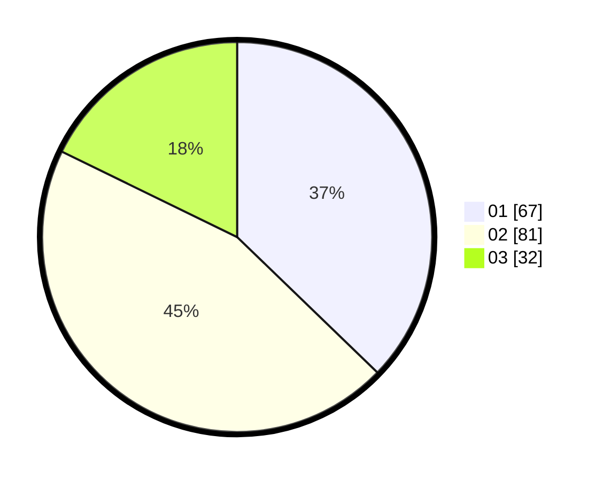

# Hasil

Hasil perolehan suara paslon dapat dilihat pada file paslon-01.txt, paslon-02.txt, dan paslon-03.txt.

Jika tidak ada, artinya data tersebut belum ada pada SIREKAP.

## Perolehan Suara

 * Paslon 01: **67**.
 * Paslon 02: **81**.
 * Paslon 03: **32**.

## Foto C Plano

https://sirekap-obj-formc.kpu.go.id/0e42/pemilu/ppwp/31/75/06/10/05/3175061005110-20240214-200158--6cca2a05-6839-4d6a-9688-6595e3186339.jpg

https://sirekap-obj-formc.kpu.go.id/0e42/pemilu/ppwp/31/75/06/10/05/3175061005110-20240214-200220--02542e1d-dd92-4dc6-b132-9d97b3abc857.jpg

https://sirekap-obj-formc.kpu.go.id/0e42/pemilu/ppwp/31/75/06/10/05/3175061005110-20240214-200324--b06f8d00-ebdd-469b-a429-a8b79b0f182b.jpg

## DATA PEMILIH TETAP

Jumlah pemilih dalam DPT: **231**.
 * L: **115**.
 * P: **116**.

## DATA PENGGUNA HAK PILIH

Jumlah pengguna hak pilih dalam DPT: **231**.
 * L: **115**.
 * P: **116**.

Jumlah pengguna hak pilih dalam DPTb: **1**.
 * L: **0**.
 * P: **1**.

Jumlah pengguna hak pilih dalam DPK: **0**.
 * L: **0**.
 * P: **0**.

Jumlah pengguna hak pilih: **232**.
 * L: **115**.
 * P: **116**.

## JUMLAH SUARA SAH DAN TIDAK SAH

JUMLAH SELURUH SUARA SAH: **180**.

JUMLAH SUARA TIDAK SAH: **4**.

JUMLAH SELURUH SUARA SAH DAN SUARA TIDAK SAH: **184**.
