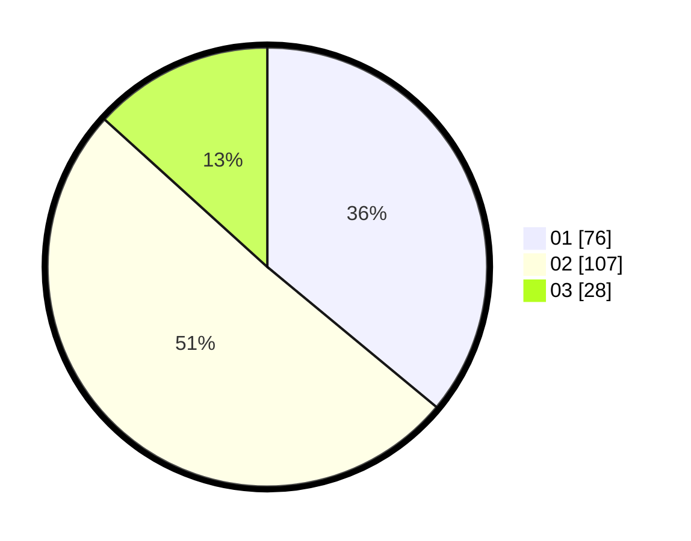

# Hasil

Hasil perolehan suara paslon dapat dilihat pada file paslon-01.txt, paslon-02.txt, dan paslon-03.txt.

Jika tidak ada, artinya data tersebut belum ada pada SIREKAP.

## Perolehan Suara

 * Paslon 01: **76**.
 * Paslon 02: **107**.
 * Paslon 03: **28**.

## Foto C Plano

https://sirekap-obj-formc.kpu.go.id/b6d4/pemilu/ppwp/31/75/06/10/05/3175061005116-20240214-211430--4d9bcaca-29a0-4281-b078-81c9f7f66b58.jpg

https://sirekap-obj-formc.kpu.go.id/b6d4/pemilu/ppwp/31/75/06/10/05/3175061005116-20240214-203541--230a949b-782f-47bd-b137-ad9a1fadda91.jpg

https://sirekap-obj-formc.kpu.go.id/b6d4/pemilu/ppwp/31/75/06/10/05/3175061005116-20240214-203329--88cb9815-34ff-4649-84e0-c90d99ecd5be.jpg
