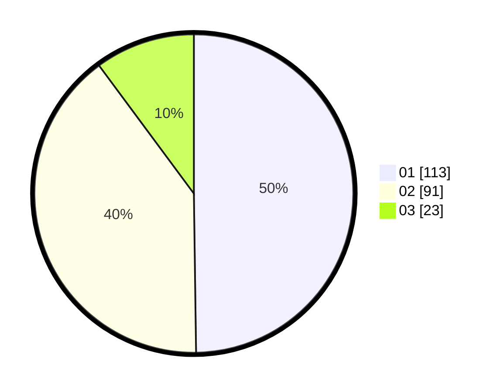

# Hasil

Hasil perolehan suara paslon dapat dilihat pada file paslon-01.txt, paslon-02.txt, dan paslon-03.txt.

Jika tidak ada, artinya data tersebut belum ada pada SIREKAP.

## Perolehan Suara

 * Paslon 01: **113**.
 * Paslon 02: **91**.
 * Paslon 03: **23**.

## Foto C Plano

https://sirekap-obj-formc.kpu.go.id/5c50/pemilu/ppwp/31/75/06/10/05/3175061005132-20240214-210913--5ca1d89f-3b3a-45fd-b9c6-c34143302a36.jpg

https://sirekap-obj-formc.kpu.go.id/5c50/pemilu/ppwp/31/75/06/10/05/3175061005132-20240214-200646--c5f15152-3d55-4aee-9bba-f603069940e2.jpg

https://sirekap-obj-formc.kpu.go.id/5c50/pemilu/ppwp/31/75/06/10/05/3175061005132-20240214-211043--1c9b8ec1-c433-46fb-81dd-4dd7791a03b7.jpg

## DATA PEMILIH TETAP

Jumlah pemilih dalam DPT: **280**.
 * L: **136**.
 * P: **144**.

## DATA PENGGUNA HAK PILIH

Jumlah pengguna hak pilih dalam DPT: **227**.
 * L: **105**.
 * P: **122**.

Jumlah pengguna hak pilih dalam DPTb: **0**.
 * L: **0**.
 * P: **0**.

Jumlah pengguna hak pilih dalam DPK: **0**.
 * L: **0**.
 * P: **0**.

Jumlah pengguna hak pilih: **227**.
 * L: **105**.
 * P: **122**.

## JUMLAH SUARA SAH DAN TIDAK SAH

JUMLAH SELURUH SUARA SAH: **227**.

JUMLAH SUARA TIDAK SAH: **0**.

JUMLAH SELURUH SUARA SAH DAN SUARA TIDAK SAH: **227**.
