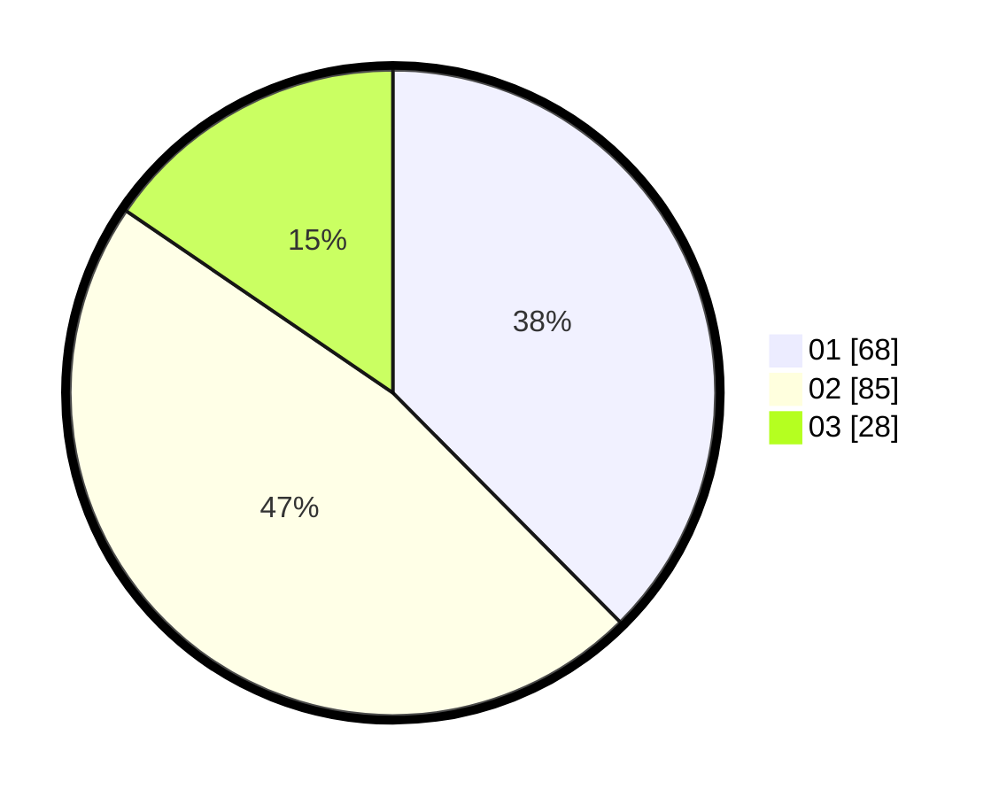

# Hasil

Hasil perolehan suara paslon dapat dilihat pada file paslon-01.txt, paslon-02.txt, dan paslon-03.txt.

Jika tidak ada, artinya data tersebut belum ada pada SIREKAP.

## Perolehan Suara

 * Paslon 01: **68**.
 * Paslon 02: **85**.
 * Paslon 03: **28**.

## Foto C Plano

https://sirekap-obj-formc.kpu.go.id/d171/pemilu/ppwp/31/75/06/10/05/3175061005136-20240214-225504--508000be-cc1a-4f7e-ad98-81de09703e73.jpg

https://sirekap-obj-formc.kpu.go.id/d171/pemilu/ppwp/31/75/06/10/05/3175061005136-20240214-225622--26359d96-f6a2-43c8-bbc7-a66f23355325.jpg
