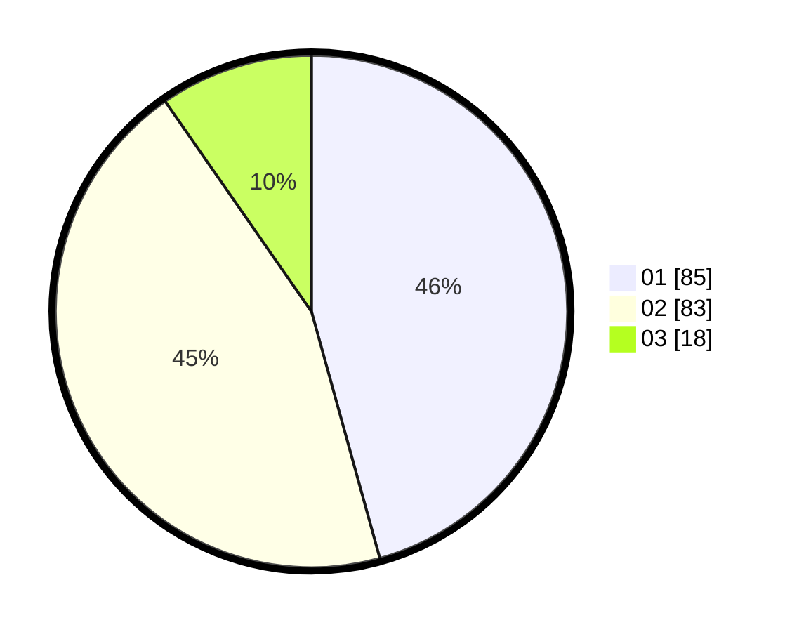

# Hasil

Hasil perolehan suara paslon dapat dilihat pada file paslon-01.txt, paslon-02.txt, dan paslon-03.txt.

Jika tidak ada, artinya data tersebut belum ada pada SIREKAP.

## Perolehan Suara

 * Paslon 01: **85**.
 * Paslon 02: **83**.
 * Paslon 03: **18**.

## Foto C Plano

https://sirekap-obj-formc.kpu.go.id/c23f/pemilu/ppwp/31/75/06/10/05/3175061005141-20240214-185214--b60baf2e-784e-4011-ac76-99df3a2f0629.jpg

https://sirekap-obj-formc.kpu.go.id/c23f/pemilu/ppwp/31/75/06/10/05/3175061005141-20240214-185707--d7655170-73f1-4979-bc9f-aa66196c5ded.jpg

https://sirekap-obj-formc.kpu.go.id/c23f/pemilu/ppwp/31/75/06/10/05/3175061005141-20240214-185600--46e1a3a5-ed4d-49c7-a738-364c5e28c01a.jpg

## DATA PEMILIH TETAP

Jumlah pemilih dalam DPT: **253**.
 * L: **120**.
 * P: **133**.

## DATA PENGGUNA HAK PILIH

Jumlah pengguna hak pilih dalam DPT: **186**.
 * L: **88**.
 * P: **98**.

Jumlah pengguna hak pilih dalam DPTb: **0**.
 * L: **0**.
 * P: **0**.

Jumlah pengguna hak pilih dalam DPK: **5**.
 * L: **3**.
 * P: **2**.

Jumlah pengguna hak pilih: **191**.
 * L: **91**.
 * P: **100**.

## JUMLAH SUARA SAH DAN TIDAK SAH

JUMLAH SELURUH SUARA SAH: **186**.

JUMLAH SUARA TIDAK SAH: **5**.

JUMLAH SELURUH SUARA SAH DAN SUARA TIDAK SAH: **191**.
