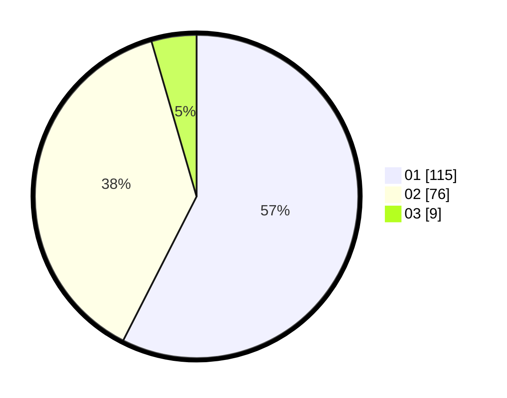

# Hasil

Hasil perolehan suara paslon dapat dilihat pada file paslon-01.txt, paslon-02.txt, dan paslon-03.txt.

Jika tidak ada, artinya data tersebut belum ada pada SIREKAP.

## Perolehan Suara

 * Paslon 01: **115**.
 * Paslon 02: **76**.
 * Paslon 03: **9**.

## Foto C Plano

https://sirekap-obj-formc.kpu.go.id/8d75/pemilu/ppwp/31/75/06/10/05/3175061005145-20240214-141256--9782ac26-d9cb-43f0-96c6-a837a4d5a57e.jpg

https://sirekap-obj-formc.kpu.go.id/8d75/pemilu/ppwp/31/75/06/10/05/3175061005145-20240214-202712--bdf4fa75-441a-4261-ab16-8dc53e780bf7.jpg

https://sirekap-obj-formc.kpu.go.id/8d75/pemilu/ppwp/31/75/06/10/05/3175061005145-20240214-213942--754a77c5-f1a1-49a6-9821-4ba1365ca24b.jpg

## DATA PEMILIH TETAP

Jumlah pemilih dalam DPT: **247**.
 * L: **118**.
 * P: **129**.

## DATA PENGGUNA HAK PILIH

Jumlah pengguna hak pilih dalam DPT: **247**.
 * L: **118**.
 * P: **129**.

Jumlah pengguna hak pilih dalam DPTb: **1**.
 * L: **1**.
 * P: **0**.

Jumlah pengguna hak pilih dalam DPK: **1**.
 * L: **0**.
 * P: **1**.

Jumlah pengguna hak pilih: **249**.
 * L: **119**.
 * P: **130**.

## JUMLAH SUARA SAH DAN TIDAK SAH

JUMLAH SELURUH SUARA SAH: **200**.

JUMLAH SUARA TIDAK SAH: **1**.

JUMLAH SELURUH SUARA SAH DAN SUARA TIDAK SAH: **201**.
