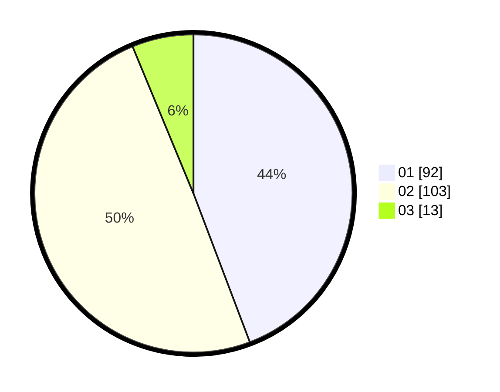

# Hasil

Hasil perolehan suara paslon dapat dilihat pada file paslon-01.txt, paslon-02.txt, dan paslon-03.txt.

Jika tidak ada, artinya data tersebut belum ada pada SIREKAP.

## Perolehan Suara

 * Paslon 01: **92**.
 * Paslon 02: **103**.
 * Paslon 03: **13**.

## Foto C Plano

https://sirekap-obj-formc.kpu.go.id/b2be/pemilu/ppwp/31/75/06/10/05/3175061005165-20240214-204955--e49d1cfb-8fdf-4225-92a7-7fc6fafe0620.jpg

https://sirekap-obj-formc.kpu.go.id/b2be/pemilu/ppwp/31/75/06/10/05/3175061005165-20240214-201308--5f13567a-43bd-4dcc-977e-995620c0b22c.jpg

https://sirekap-obj-formc.kpu.go.id/b2be/pemilu/ppwp/31/75/06/10/05/3175061005165-20240214-201454--9b461110-dcde-42be-80d0-ece8fb239b9a.jpg
