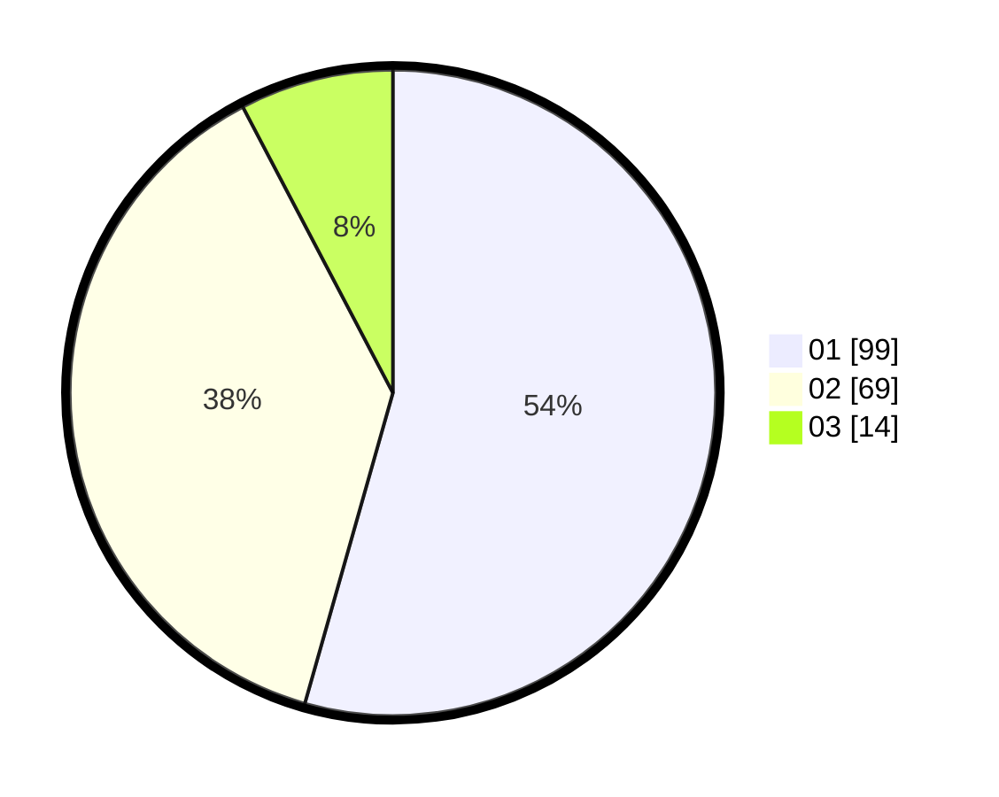

# Hasil

Hasil perolehan suara paslon dapat dilihat pada file paslon-01.txt, paslon-02.txt, dan paslon-03.txt.

Jika tidak ada, artinya data tersebut belum ada pada SIREKAP.

## Perolehan Suara

 * Paslon 01: **99**.
 * Paslon 02: **69**.
 * Paslon 03: **14**.

## Foto C Plano

https://sirekap-obj-formc.kpu.go.id/08f9/pemilu/ppwp/31/75/06/10/05/3175061005182-20240214-204826--961db971-eba1-4561-a2f5-f533d6f31bc2.jpg

https://sirekap-obj-formc.kpu.go.id/08f9/pemilu/ppwp/31/75/06/10/05/3175061005182-20240214-204843--2912f68a-d7af-406d-ac4b-6109061e82f1.jpg

https://sirekap-obj-formc.kpu.go.id/08f9/pemilu/ppwp/31/75/06/10/05/3175061005182-20240214-204859--feb97866-a683-41bb-a536-cc72cd2e3366.jpg
