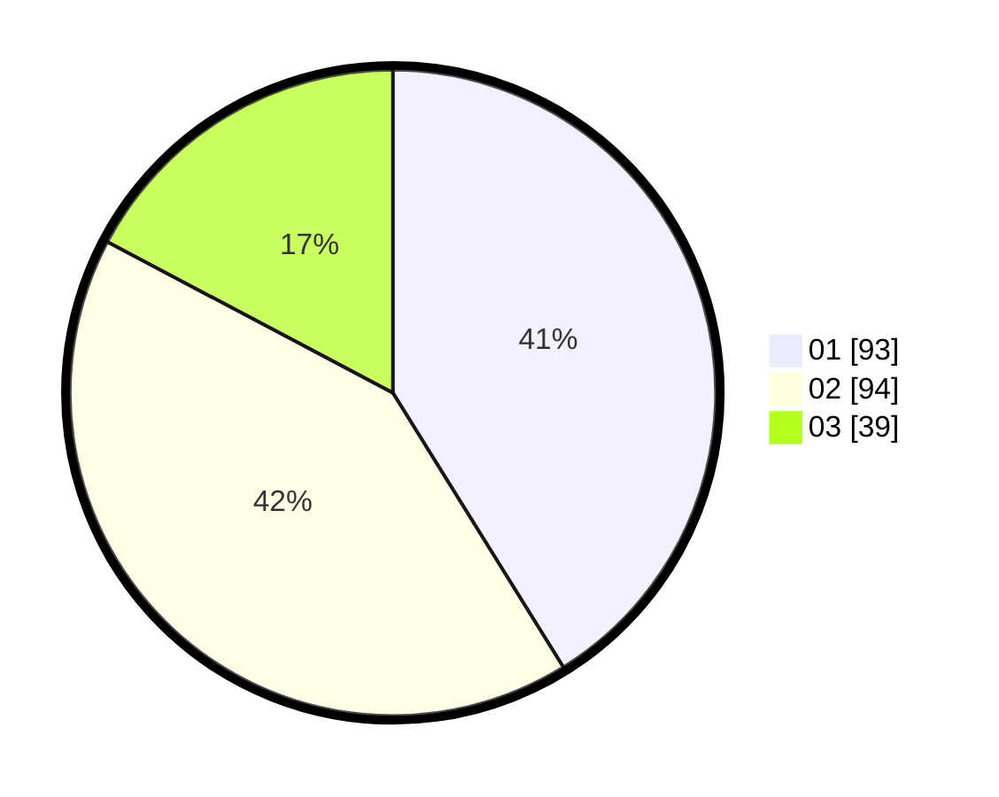

# Hasil

Hasil perolehan suara paslon dapat dilihat pada file paslon-01.txt, paslon-02.txt, dan paslon-03.txt.

Jika tidak ada, artinya data tersebut belum ada pada SIREKAP.

## Perolehan Suara

 * Paslon 01: **93**.
 * Paslon 02: **94**.
 * Paslon 03: **39**.

## Foto C Plano

https://sirekap-obj-formc.kpu.go.id/643d/pemilu/ppwp/31/75/06/10/05/3175061005185-20240214-184929--18da8c54-2692-4c0a-b06c-8db32d5741e4.jpg

https://sirekap-obj-formc.kpu.go.id/643d/pemilu/ppwp/31/75/06/10/05/3175061005185-20240214-184459--3ffb1862-3940-4c9a-aab5-d24b5059448b.jpg

https://sirekap-obj-formc.kpu.go.id/643d/pemilu/ppwp/31/75/06/10/05/3175061005185-20240214-184426--01308095-227f-421e-8493-5a29046edc05.jpg

## DATA PEMILIH TETAP

Jumlah pemilih dalam DPT: **282**.
 * L: **141**.
 * P: **141**.

## DATA PENGGUNA HAK PILIH

Jumlah pengguna hak pilih dalam DPT: **226**.
 * L: **110**.
 * P: **116**.

Jumlah pengguna hak pilih dalam DPTb: **1**.
 * L: **1**.
 * P: **0**.

Jumlah pengguna hak pilih dalam DPK: **0**.
 * L: **0**.
 * P: **0**.

Jumlah pengguna hak pilih: **227**.
 * L: **111**.
 * P: **116**.

## JUMLAH SUARA SAH DAN TIDAK SAH

JUMLAH SELURUH SUARA SAH: **226**.

JUMLAH SUARA TIDAK SAH: **1**.

JUMLAH SELURUH SUARA SAH DAN SUARA TIDAK SAH: **227**.
