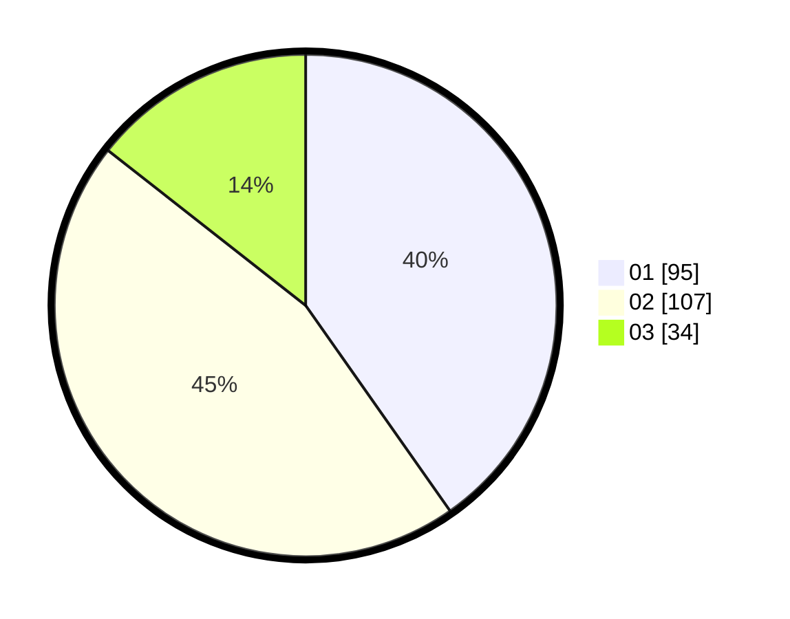

# Hasil

Hasil perolehan suara paslon dapat dilihat pada file paslon-01.txt, paslon-02.txt, dan paslon-03.txt.

Jika tidak ada, artinya data tersebut belum ada pada SIREKAP.

## Perolehan Suara

 * Paslon 01: **95**.
 * Paslon 02: **107**.
 * Paslon 03: **34**.

## Foto C Plano

https://sirekap-obj-formc.kpu.go.id/7629/pemilu/ppwp/31/75/06/10/05/3175061005188-20240214-223255--dd77921f-3abc-49c1-99b6-264fe424cfa1.jpg

https://sirekap-obj-formc.kpu.go.id/7629/pemilu/ppwp/31/75/06/10/05/3175061005188-20240214-223347--bde0066e-fdf1-4cbe-b6a0-2d84ad2e9b49.jpg

https://sirekap-obj-formc.kpu.go.id/7629/pemilu/ppwp/31/75/06/10/05/3175061005188-20240214-223110--c18199f0-c211-4249-9be3-4b1968711976.jpg
