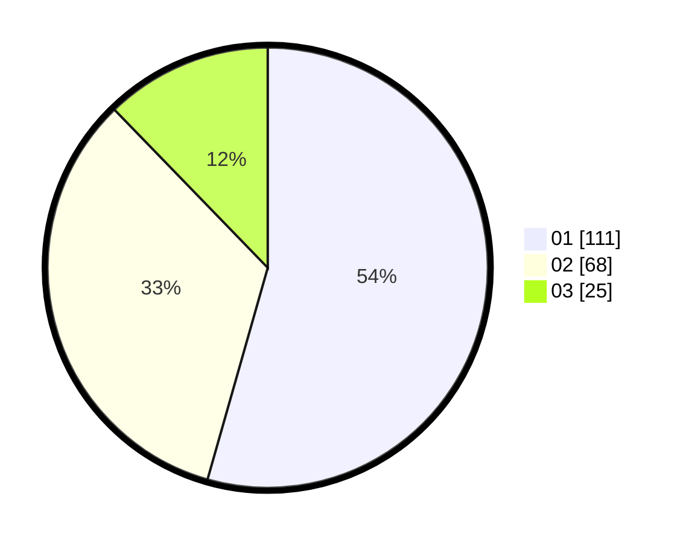

# Hasil

Hasil perolehan suara paslon dapat dilihat pada file paslon-01.txt, paslon-02.txt, dan paslon-03.txt.

Jika tidak ada, artinya data tersebut belum ada pada SIREKAP.

## Perolehan Suara

 * Paslon 01: **111**.
 * Paslon 02: **68**.
 * Paslon 03: **25**.

## Foto C Plano

https://sirekap-obj-formc.kpu.go.id/53f1/pemilu/ppwp/31/75/06/10/05/3175061005194-20240214-225435--3daa51c8-9740-46d5-af05-19e050e81234.jpg

https://sirekap-obj-formc.kpu.go.id/53f1/pemilu/ppwp/31/75/06/10/05/3175061005194-20240214-225844--1ab75240-5f69-47a4-bb95-af15e7a7d8ec.jpg

https://sirekap-obj-formc.kpu.go.id/53f1/pemilu/ppwp/31/75/06/10/05/3175061005194-20240214-230230--6def78e6-d414-488d-af04-1db8897b5137.jpg

## DATA PEMILIH TETAP

Jumlah pemilih dalam DPT: **252**.
 * L: **119**.
 * P: **133**.

## DATA PENGGUNA HAK PILIH

Jumlah pengguna hak pilih dalam DPT: **204**.
 * L: **88**.
 * P: **116**.

Jumlah pengguna hak pilih dalam DPTb: **4**.
 * L: **2**.
 * P: **2**.

Jumlah pengguna hak pilih dalam DPK: **1**.
 * L: **0**.
 * P: **1**.

Jumlah pengguna hak pilih: **209**.
 * L: **90**.
 * P: **119**.

## JUMLAH SUARA SAH DAN TIDAK SAH

JUMLAH SELURUH SUARA SAH: **204**.

JUMLAH SUARA TIDAK SAH: **5**.

JUMLAH SELURUH SUARA SAH DAN SUARA TIDAK SAH: **209**.
