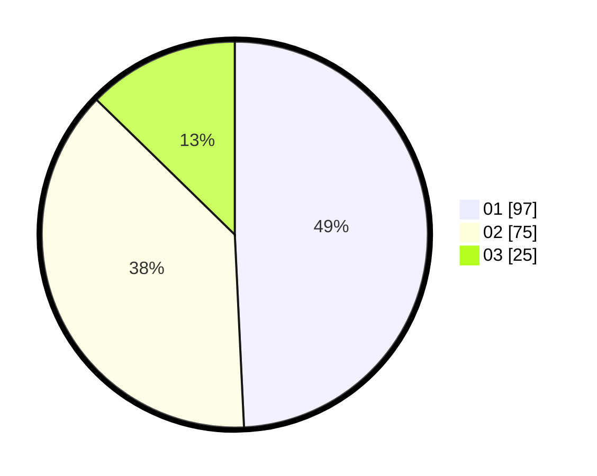

# Hasil

Hasil perolehan suara paslon dapat dilihat pada file paslon-01.txt, paslon-02.txt, dan paslon-03.txt.

Jika tidak ada, artinya data tersebut belum ada pada SIREKAP.

## Perolehan Suara

 * Paslon 01: **97**.
 * Paslon 02: **75**.
 * Paslon 03: **25**.

## Foto C Plano

https://sirekap-obj-formc.kpu.go.id/c3d1/pemilu/ppwp/31/75/06/10/05/3175061005199-20240214-222145--30325ddc-bcb6-4597-bdcb-e8922505123c.jpg

https://sirekap-obj-formc.kpu.go.id/c3d1/pemilu/ppwp/31/75/06/10/05/3175061005199-20240214-222031--03aa9789-01d1-42e9-9678-31b1e66e83db.jpg

https://sirekap-obj-formc.kpu.go.id/c3d1/pemilu/ppwp/31/75/06/10/05/3175061005199-20240214-222220--34c402e3-8ae7-4bb0-b111-3e9edb532fa6.jpg
