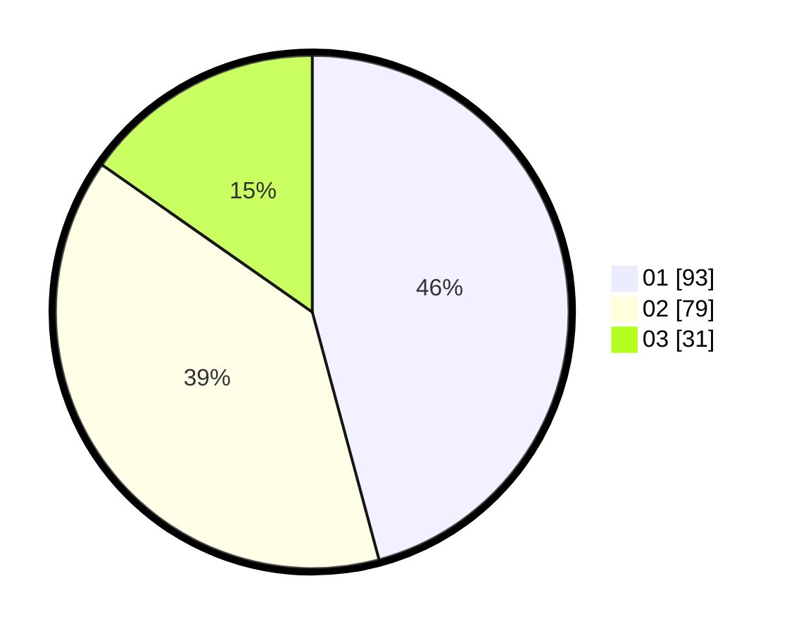

# Hasil

Hasil perolehan suara paslon dapat dilihat pada file paslon-01.txt, paslon-02.txt, dan paslon-03.txt.

Jika tidak ada, artinya data tersebut belum ada pada SIREKAP.

## Perolehan Suara

 * Paslon 01: **93**.
 * Paslon 02: **79**.
 * Paslon 03: **31**.

## Foto C Plano

https://sirekap-obj-formc.kpu.go.id/c670/pemilu/ppwp/31/75/06/10/05/3175061005200-20240214-221701--bfd88911-9883-463d-b7cd-cd00a64e62fa.jpg

https://sirekap-obj-formc.kpu.go.id/c670/pemilu/ppwp/31/75/06/10/05/3175061005200-20240215-063423--26a0fc36-df16-4e4d-9219-d228334560ca.jpg

https://sirekap-obj-formc.kpu.go.id/c670/pemilu/ppwp/31/75/06/10/05/3175061005200-20240215-063738--addcd8bc-3929-49c6-8d5a-439c34163ab7.jpg
