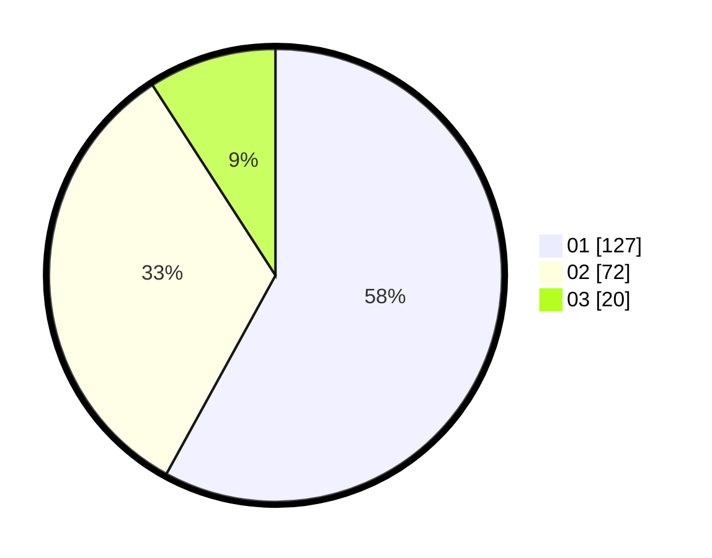

# Hasil

Hasil perolehan suara paslon dapat dilihat pada file paslon-01.txt, paslon-02.txt, dan paslon-03.txt.

Jika tidak ada, artinya data tersebut belum ada pada SIREKAP.

## Perolehan Suara

 * Paslon 01: **127**.
 * Paslon 02: **72**.
 * Paslon 03: **20**.

## Foto C Plano

https://sirekap-obj-formc.kpu.go.id/51ce/pemilu/ppwp/31/75/06/10/05/3175061005205-20240214-194258--f9e2ef95-90bd-404e-a2ab-66041acd1c1e.jpg

https://sirekap-obj-formc.kpu.go.id/51ce/pemilu/ppwp/31/75/06/10/05/3175061005205-20240214-201822--e2687eca-46dd-4bdc-941e-5c43371695b1.jpg

https://sirekap-obj-formc.kpu.go.id/51ce/pemilu/ppwp/31/75/06/10/05/3175061005205-20240214-233459--0f32662d-78b4-4965-8e88-ce94ef35a909.jpg

## DATA PEMILIH TETAP

Jumlah pemilih dalam DPT: **269**.
 * L: **131**.
 * P: **138**.

## DATA PENGGUNA HAK PILIH

Jumlah pengguna hak pilih dalam DPT: **222**.
 * L: **110**.
 * P: **112**.

Jumlah pengguna hak pilih dalam DPTb: **1**.
 * L: **0**.
 * P: **1**.

Jumlah pengguna hak pilih dalam DPK: **2**.
 * L: **1**.
 * P: **1**.

Jumlah pengguna hak pilih: **225**.
 * L: **111**.
 * P: **114**.

## JUMLAH SUARA SAH DAN TIDAK SAH

JUMLAH SELURUH SUARA SAH: **219**.

JUMLAH SUARA TIDAK SAH: **6**.

JUMLAH SELURUH SUARA SAH DAN SUARA TIDAK SAH: **225**.
