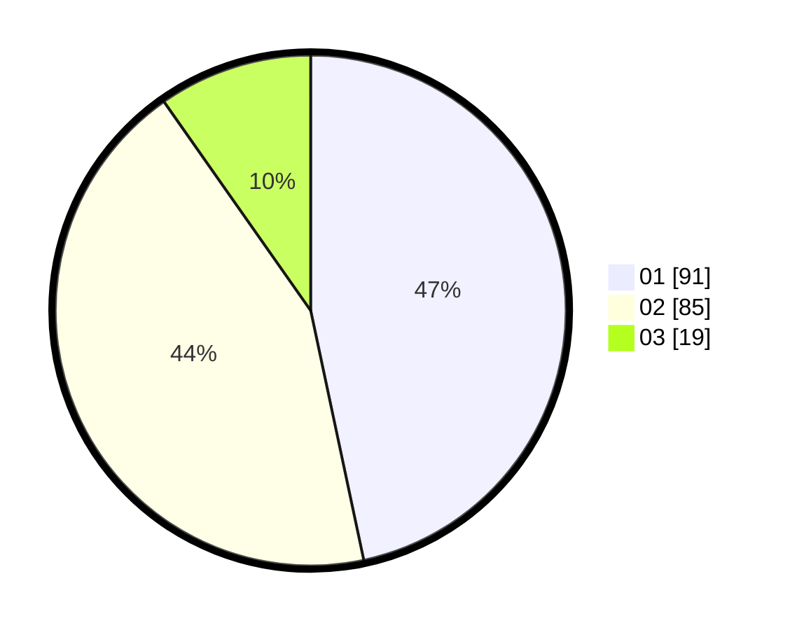

# Hasil

Hasil perolehan suara paslon dapat dilihat pada file paslon-01.txt, paslon-02.txt, dan paslon-03.txt.

Jika tidak ada, artinya data tersebut belum ada pada SIREKAP.

## Perolehan Suara

 * Paslon 01: **91**.
 * Paslon 02: **85**.
 * Paslon 03: **19**.

## Foto C Plano

https://sirekap-obj-formc.kpu.go.id/8dba/pemilu/ppwp/31/75/06/10/05/3175061005208-20240214-222956--fa45260e-f34b-4f0d-84c1-d8fc4e841a22.jpg

https://sirekap-obj-formc.kpu.go.id/8dba/pemilu/ppwp/31/75/06/10/05/3175061005208-20240214-192658--3882f1fc-4121-402e-b2b8-66c3f6f23817.jpg

https://sirekap-obj-formc.kpu.go.id/8dba/pemilu/ppwp/31/75/06/10/05/3175061005208-20240214-223113--d69f95c3-32ec-4d0a-b626-8dfb6a1e6183.jpg

## DATA PEMILIH TETAP

Jumlah pemilih dalam DPT: **237**.
 * L: **124**.
 * P: **113**.

## DATA PENGGUNA HAK PILIH

Jumlah pengguna hak pilih dalam DPT: **196**.
 * L: **100**.
 * P: **96**.

Jumlah pengguna hak pilih dalam DPTb: **1**.
 * L: **0**.
 * P: **1**.

Jumlah pengguna hak pilih dalam DPK: **0**.
 * L: **0**.
 * P: **0**.

Jumlah pengguna hak pilih: **197**.
 * L: **100**.
 * P: **97**.

## JUMLAH SUARA SAH DAN TIDAK SAH

JUMLAH SELURUH SUARA SAH: **195**.

JUMLAH SUARA TIDAK SAH: **2**.

JUMLAH SELURUH SUARA SAH DAN SUARA TIDAK SAH: **197**.
