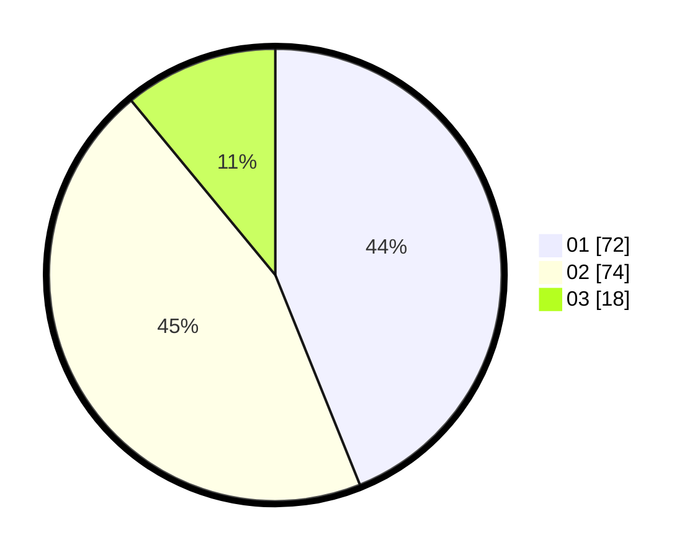

# Hasil

Hasil perolehan suara paslon dapat dilihat pada file paslon-01.txt, paslon-02.txt, dan paslon-03.txt.

Jika tidak ada, artinya data tersebut belum ada pada SIREKAP.

## Perolehan Suara

 * Paslon 01: **72**.
 * Paslon 02: **74**.
 * Paslon 03: **18**.

## Foto C Plano

https://sirekap-obj-formc.kpu.go.id/4c16/pemilu/ppwp/31/75/06/10/05/3175061005219-20240214-192430--3de9467e-e05a-46b6-8ca0-b566f1eeeea2.jpg

https://sirekap-obj-formc.kpu.go.id/4c16/pemilu/ppwp/31/75/06/10/05/3175061005219-20240214-192453--000fe620-9c85-4ac5-96aa-c6347456540b.jpg

https://sirekap-obj-formc.kpu.go.id/4c16/pemilu/ppwp/31/75/06/10/05/3175061005219-20240214-192512--79b10969-7a45-444b-a982-c63a473a29dc.jpg

## DATA PEMILIH TETAP

Jumlah pemilih dalam DPT: **210**.
 * L: **102**.
 * P: **108**.

## DATA PENGGUNA HAK PILIH

Jumlah pengguna hak pilih dalam DPT: **167**.
 * L: **78**.
 * P: **89**.

Jumlah pengguna hak pilih dalam DPTb: **0**.
 * L: **0**.
 * P: **0**.

Jumlah pengguna hak pilih dalam DPK: **0**.
 * L: **0**.
 * P: **0**.

Jumlah pengguna hak pilih: **167**.
 * L: **78**.
 * P: **89**.

## JUMLAH SUARA SAH DAN TIDAK SAH

JUMLAH SELURUH SUARA SAH: **164**.

JUMLAH SUARA TIDAK SAH: **3**.

JUMLAH SELURUH SUARA SAH DAN SUARA TIDAK SAH: **167**.
