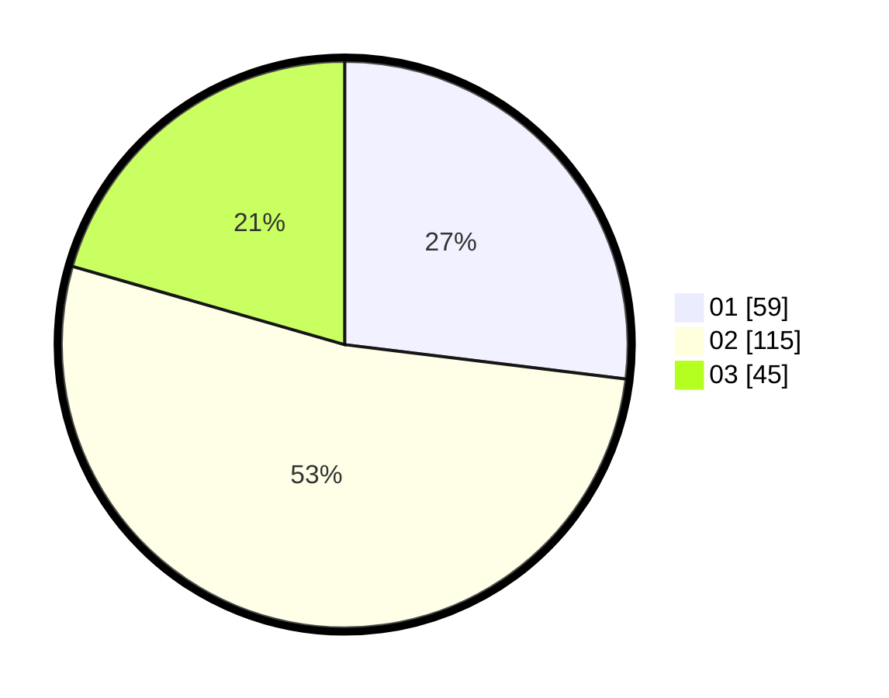

# Hasil

Hasil perolehan suara paslon dapat dilihat pada file paslon-01.txt, paslon-02.txt, dan paslon-03.txt.

Jika tidak ada, artinya data tersebut belum ada pada SIREKAP.

## Perolehan Suara

 * Paslon 01: **59**.
 * Paslon 02: **115**.
 * Paslon 03: **45**.

## Foto C Plano

https://sirekap-obj-formc.kpu.go.id/f36a/pemilu/ppwp/31/75/06/10/05/3175061005243-20240214-221805--6a11b63f-8617-4733-8e67-cf6e64053ff4.jpg

https://sirekap-obj-formc.kpu.go.id/f36a/pemilu/ppwp/31/75/06/10/05/3175061005243-20240214-222104--261d21c4-fd08-418e-8160-9dcefdc61aca.jpg

https://sirekap-obj-formc.kpu.go.id/f36a/pemilu/ppwp/31/75/06/10/05/3175061005243-20240214-222020--eab29bc0-38b5-4b7c-bbe1-09451a919079.jpg
