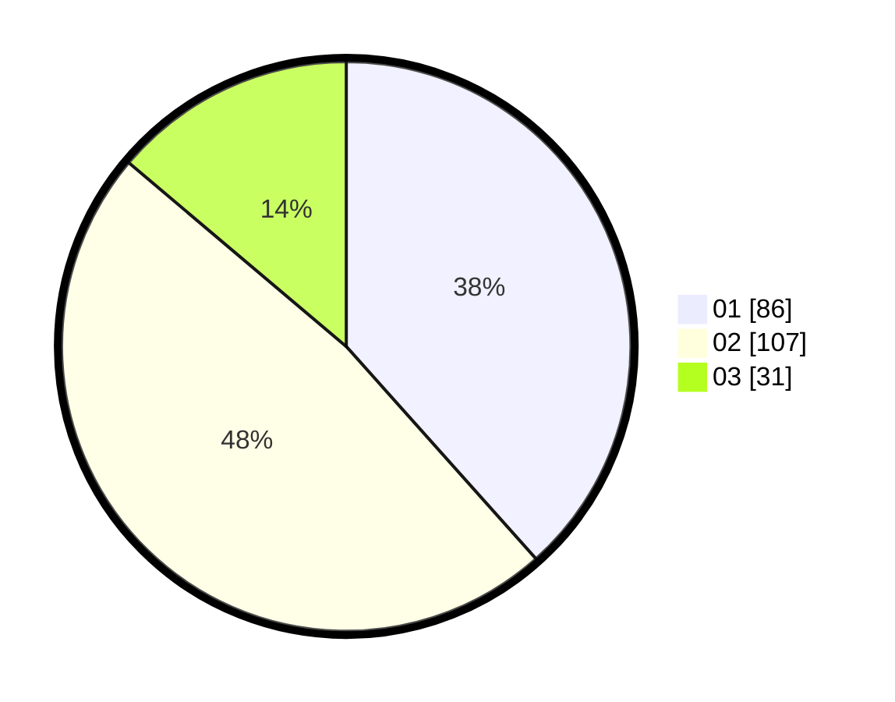

# Hasil

Hasil perolehan suara paslon dapat dilihat pada file paslon-01.txt, paslon-02.txt, dan paslon-03.txt.

Jika tidak ada, artinya data tersebut belum ada pada SIREKAP.

## Perolehan Suara

 * Paslon 01: **86**.
 * Paslon 02: **107**.
 * Paslon 03: **31**.

## Foto C Plano

https://sirekap-obj-formc.kpu.go.id/2008/pemilu/ppwp/31/75/06/10/05/3175061005255-20240215-020816--f8805e02-7ffa-490e-96a6-1b573c293213.jpg

https://sirekap-obj-formc.kpu.go.id/2008/pemilu/ppwp/31/75/06/10/05/3175061005255-20240214-204237--58400447-c142-4824-8222-2f20000b8e95.jpg

https://sirekap-obj-formc.kpu.go.id/2008/pemilu/ppwp/31/75/06/10/05/3175061005255-20240214-204400--28d08c7f-506b-42dd-a97a-c7581a047b63.jpg
