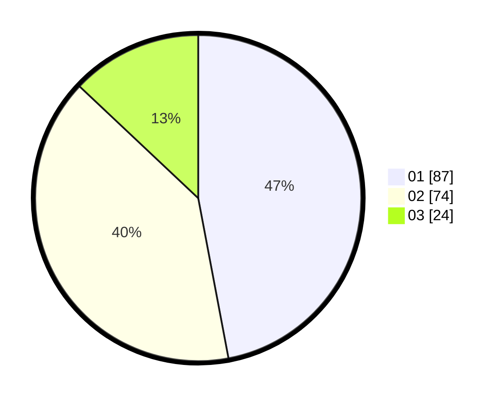

# Hasil

Hasil perolehan suara paslon dapat dilihat pada file paslon-01.txt, paslon-02.txt, dan paslon-03.txt.

Jika tidak ada, artinya data tersebut belum ada pada SIREKAP.

## Perolehan Suara

 * Paslon 01: **87**.
 * Paslon 02: **74**.
 * Paslon 03: **24**.

## Foto C Plano

https://sirekap-obj-formc.kpu.go.id/6a7e/pemilu/ppwp/31/75/06/10/05/3175061005262-20240214-221941--0a72997d-0924-4f72-878d-30ed8dcd7f16.jpg

https://sirekap-obj-formc.kpu.go.id/6a7e/pemilu/ppwp/31/75/06/10/05/3175061005262-20240214-222014--926784d5-6eaf-43f9-85de-8fb0c0fb9ff9.jpg

https://sirekap-obj-formc.kpu.go.id/6a7e/pemilu/ppwp/31/75/06/10/05/3175061005262-20240214-222056--f0a4f291-f4e3-418e-a3e4-0245c38ecec6.jpg

## DATA PEMILIH TETAP

Jumlah pemilih dalam DPT: **242**.
 * L: **117**.
 * P: **125**.

## DATA PENGGUNA HAK PILIH

Jumlah pengguna hak pilih dalam DPT: **181**.
 * L: **84**.
 * P: **97**.

Jumlah pengguna hak pilih dalam DPTb: **5**.
 * L: **2**.
 * P: **3**.

Jumlah pengguna hak pilih dalam DPK: **3**.
 * L: **1**.
 * P: **2**.

Jumlah pengguna hak pilih: **189**.
 * L: **87**.
 * P: **102**.

## JUMLAH SUARA SAH DAN TIDAK SAH

JUMLAH SELURUH SUARA SAH: **186**.

JUMLAH SUARA TIDAK SAH: **3**.

JUMLAH SELURUH SUARA SAH DAN SUARA TIDAK SAH: **189**.
