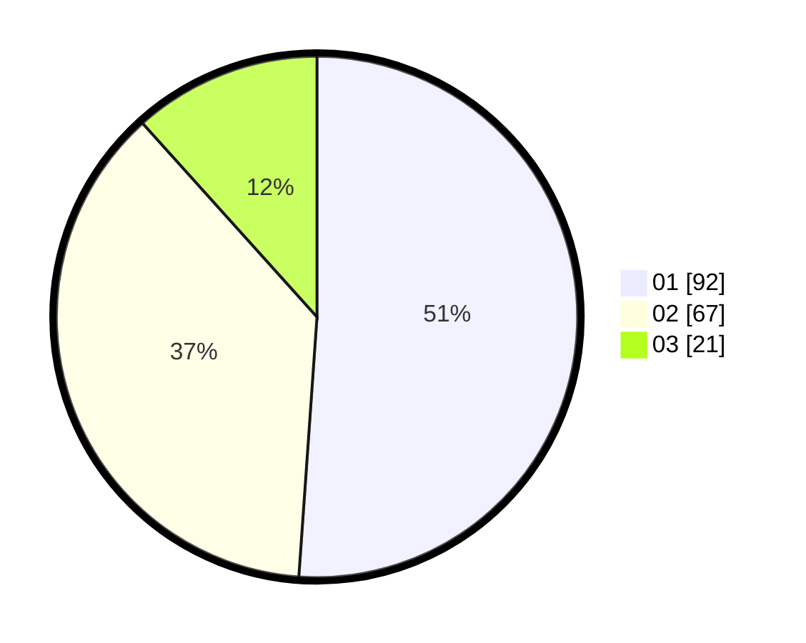

# Hasil

Hasil perolehan suara paslon dapat dilihat pada file paslon-01.txt, paslon-02.txt, dan paslon-03.txt.

Jika tidak ada, artinya data tersebut belum ada pada SIREKAP.

## Perolehan Suara

 * Paslon 01: **92**.
 * Paslon 02: **67**.
 * Paslon 03: **21**.

## Foto C Plano

https://sirekap-obj-formc.kpu.go.id/5ed4/pemilu/ppwp/31/75/06/10/05/3175061005266-20240214-191729--57199b5b-132d-4b75-ab52-9761f73a84c1.jpg

https://sirekap-obj-formc.kpu.go.id/5ed4/pemilu/ppwp/31/75/06/10/05/3175061005266-20240214-195716--2261caaa-dbbc-4ab4-b4ec-2ab58c7c0c0f.jpg

https://sirekap-obj-formc.kpu.go.id/5ed4/pemilu/ppwp/31/75/06/10/05/3175061005266-20240214-203037--c452bd08-ad77-457e-8f72-07c6850dbabb.jpg

## DATA PEMILIH TETAP

Jumlah pemilih dalam DPT: **254**.
 * L: **121**.
 * P: **133**.

## DATA PENGGUNA HAK PILIH

Jumlah pengguna hak pilih dalam DPT: **178**.
 * L: **75**.
 * P: **103**.

Jumlah pengguna hak pilih dalam DPTb: **2**.
 * L: **1**.
 * P: **1**.

Jumlah pengguna hak pilih dalam DPK: **2**.
 * L: **1**.
 * P: **1**.

Jumlah pengguna hak pilih: **182**.
 * L: **77**.
 * P: **105**.

## JUMLAH SUARA SAH DAN TIDAK SAH

JUMLAH SELURUH SUARA SAH: **180**.

JUMLAH SUARA TIDAK SAH: **2**.

JUMLAH SELURUH SUARA SAH DAN SUARA TIDAK SAH: **182**.
