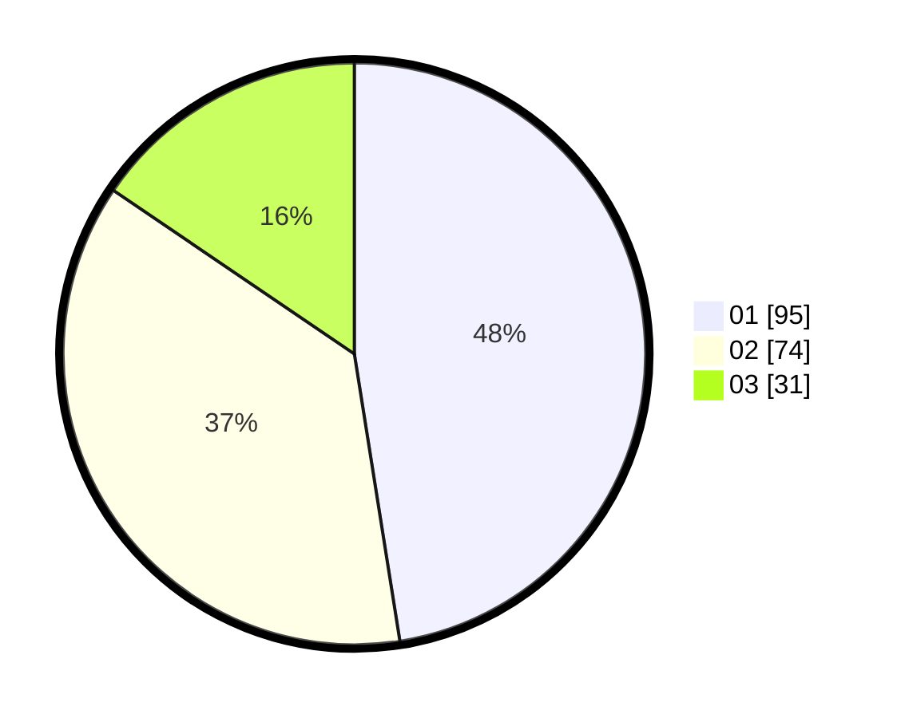

# Hasil

Hasil perolehan suara paslon dapat dilihat pada file paslon-01.txt, paslon-02.txt, dan paslon-03.txt.

Jika tidak ada, artinya data tersebut belum ada pada SIREKAP.

## Perolehan Suara

 * Paslon 01: **95**.
 * Paslon 02: **74**.
 * Paslon 03: **31**.

## Foto C Plano

https://sirekap-obj-formc.kpu.go.id/7e5c/pemilu/ppwp/31/75/06/10/05/3175061005268-20240214-220728--6984ef18-5897-4e0b-b09a-9acfd6bbfdf9.jpg

https://sirekap-obj-formc.kpu.go.id/7e5c/pemilu/ppwp/31/75/06/10/05/3175061005268-20240214-220749--5881ce0b-af6c-4ffa-8347-dd9a06fc20a8.jpg

https://sirekap-obj-formc.kpu.go.id/7e5c/pemilu/ppwp/31/75/06/10/05/3175061005268-20240214-220738--edc0c0d1-cd09-415b-a48a-a6a7c74852c4.jpg

## DATA PEMILIH TETAP

Jumlah pemilih dalam DPT: **0**.
 * L: **0**.
 * P: **0**.

## DATA PENGGUNA HAK PILIH

Jumlah pengguna hak pilih dalam DPT: **0**.
 * L: **0**.
 * P: **0**.

Jumlah pengguna hak pilih dalam DPTb: **0**.
 * L: **0**.
 * P: **0**.

Jumlah pengguna hak pilih dalam DPK: **0**.
 * L: **0**.
 * P: **0**.

Jumlah pengguna hak pilih: **0**.
 * L: **0**.
 * P: **0**.

## JUMLAH SUARA SAH DAN TIDAK SAH

JUMLAH SELURUH SUARA SAH: **200**.

JUMLAH SUARA TIDAK SAH: **3**.

JUMLAH SELURUH SUARA SAH DAN SUARA TIDAK SAH: **203**.
