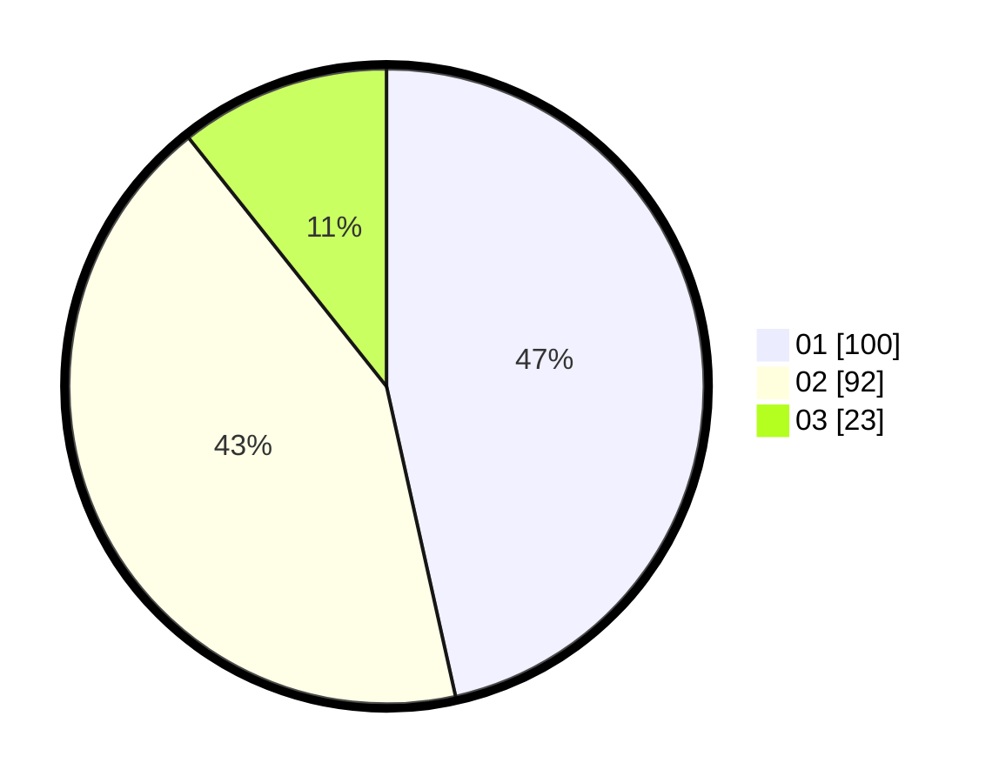

# Hasil

Hasil perolehan suara paslon dapat dilihat pada file paslon-01.txt, paslon-02.txt, dan paslon-03.txt.

Jika tidak ada, artinya data tersebut belum ada pada SIREKAP.

## Perolehan Suara

 * Paslon 01: **100**.
 * Paslon 02: **92**.
 * Paslon 03: **23**.

## Foto C Plano

https://sirekap-obj-formc.kpu.go.id/4319/pemilu/ppwp/31/75/06/10/05/3175061005271-20240214-141942--c8d91658-8d6b-4031-9134-966fca6f6bb2.jpg

https://sirekap-obj-formc.kpu.go.id/4319/pemilu/ppwp/31/75/06/10/05/3175061005271-20240214-190601--94336960-5115-4665-bf7b-a8083032a5ad.jpg

https://sirekap-obj-formc.kpu.go.id/4319/pemilu/ppwp/31/75/06/10/05/3175061005271-20240214-190459--ecae1073-3583-449d-a255-314470532ee5.jpg

## DATA PEMILIH TETAP

Jumlah pemilih dalam DPT: **248**.
 * L: **126**.
 * P: **122**.

## DATA PENGGUNA HAK PILIH

Jumlah pengguna hak pilih dalam DPT: **216**.
 * L: **112**.
 * P: **104**.

Jumlah pengguna hak pilih dalam DPTb: **2**.
 * L: **1**.
 * P: **1**.

Jumlah pengguna hak pilih dalam DPK: **0**.
 * L: **0**.
 * P: **0**.

Jumlah pengguna hak pilih: **218**.
 * L: **113**.
 * P: **105**.

## JUMLAH SUARA SAH DAN TIDAK SAH

JUMLAH SELURUH SUARA SAH: **215**.

JUMLAH SUARA TIDAK SAH: **3**.

JUMLAH SELURUH SUARA SAH DAN SUARA TIDAK SAH: **218**.
