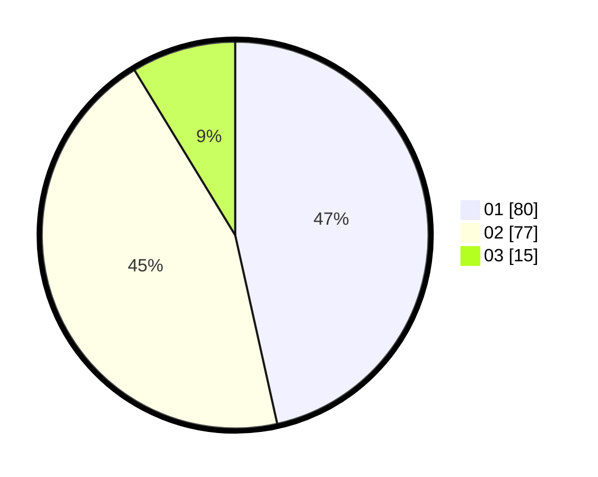

# Hasil

Hasil perolehan suara paslon dapat dilihat pada file paslon-01.txt, paslon-02.txt, dan paslon-03.txt.

Jika tidak ada, artinya data tersebut belum ada pada SIREKAP.

## Perolehan Suara

 * Paslon 01: **80**.
 * Paslon 02: **77**.
 * Paslon 03: **15**.

## Foto C Plano

https://sirekap-obj-formc.kpu.go.id/e14b/pemilu/ppwp/31/75/06/10/05/3175061005275-20240214-203045--97f186e0-abfb-4dba-9fc6-af4930a2f4d7.jpg

https://sirekap-obj-formc.kpu.go.id/e14b/pemilu/ppwp/31/75/06/10/05/3175061005275-20240214-203150--7099cb02-db56-4cf9-b5f1-3d439ca30f45.jpg

https://sirekap-obj-formc.kpu.go.id/e14b/pemilu/ppwp/31/75/06/10/05/3175061005275-20240214-203240--f5d3ab79-dbc8-4562-bd6d-09ee2a1e0558.jpg
