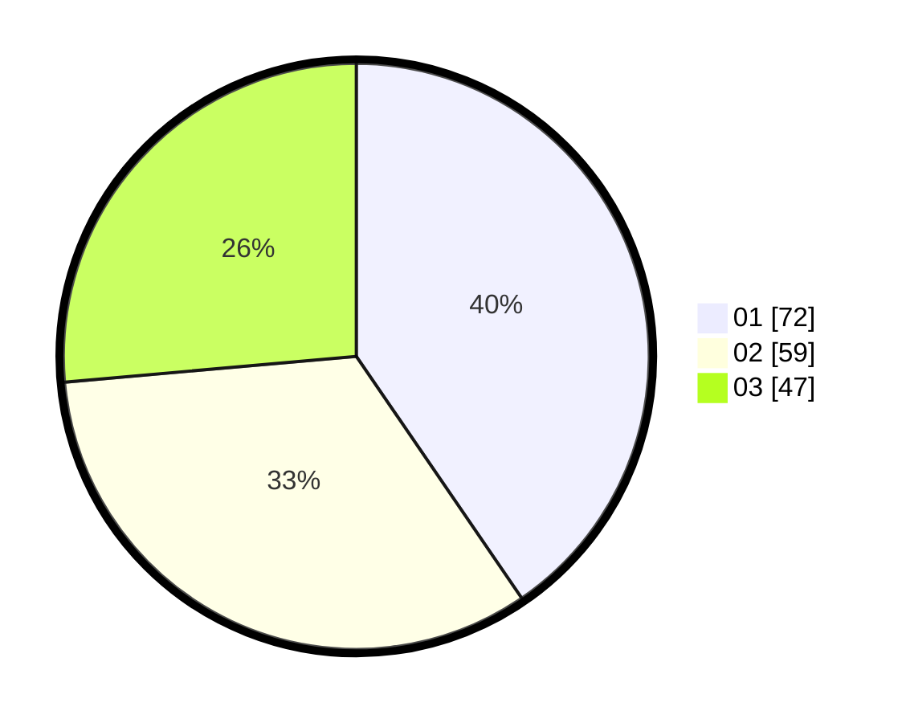

# Hasil

Hasil perolehan suara paslon dapat dilihat pada file paslon-01.txt, paslon-02.txt, dan paslon-03.txt.

Jika tidak ada, artinya data tersebut belum ada pada SIREKAP.

## Perolehan Suara

 * Paslon 01: **72**.
 * Paslon 02: **59**.
 * Paslon 03: **47**.

## Foto C Plano

https://sirekap-obj-formc.kpu.go.id/654e/pemilu/ppwp/31/75/06/10/05/3175061005281-20240214-201202--2f7070a7-2b3e-46ac-842b-4167d1d94c80.jpg

https://sirekap-obj-formc.kpu.go.id/654e/pemilu/ppwp/31/75/06/10/05/3175061005281-20240214-201220--fa1f31e1-7ed4-44ac-a1b3-d60eef18a547.jpg

https://sirekap-obj-formc.kpu.go.id/654e/pemilu/ppwp/31/75/06/10/05/3175061005281-20240214-201236--916dab1d-b376-4a29-86d9-68887dd9261f.jpg

## DATA PEMILIH TETAP

Jumlah pemilih dalam DPT: **209**.
 * L: **98**.
 * P: **111**.

## DATA PENGGUNA HAK PILIH

Jumlah pengguna hak pilih dalam DPT: **172**.
 * L: **80**.
 * P: **92**.

Jumlah pengguna hak pilih dalam DPTb: **5**.
 * L: **3**.
 * P: **2**.

Jumlah pengguna hak pilih dalam DPK: **5**.
 * L: **4**.
 * P: **1**.

Jumlah pengguna hak pilih: **182**.
 * L: **87**.
 * P: **95**.

## JUMLAH SUARA SAH DAN TIDAK SAH

JUMLAH SELURUH SUARA SAH: **178**.

JUMLAH SUARA TIDAK SAH: **4**.

JUMLAH SELURUH SUARA SAH DAN SUARA TIDAK SAH: **182**.
