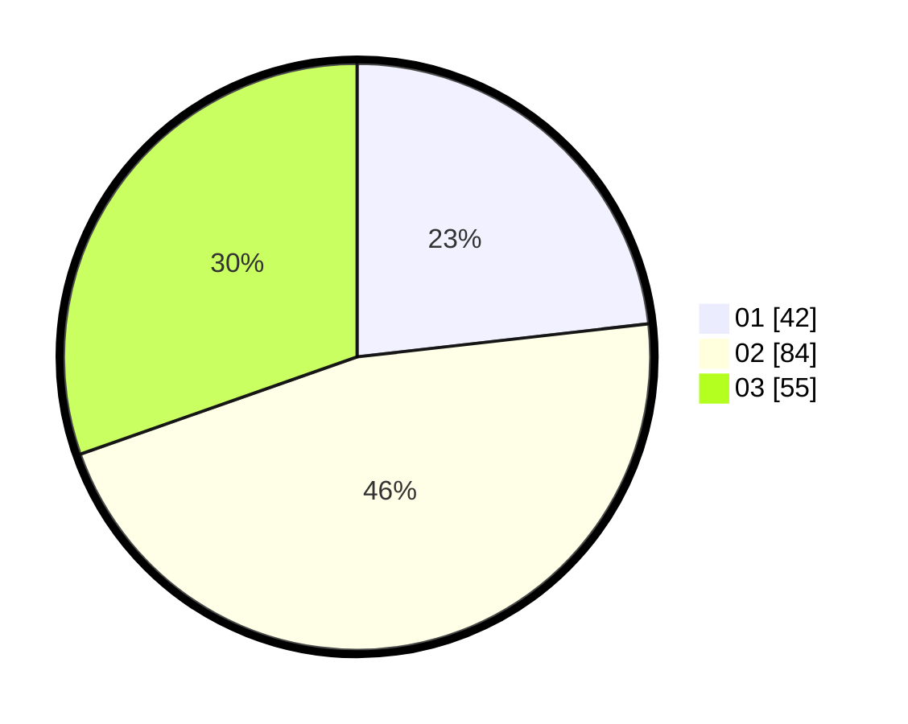

# Hasil

Hasil perolehan suara paslon dapat dilihat pada file paslon-01.txt, paslon-02.txt, dan paslon-03.txt.

Jika tidak ada, artinya data tersebut belum ada pada SIREKAP.

## Perolehan Suara

 * Paslon 01: **42**.
 * Paslon 02: **84**.
 * Paslon 03: **55**.

## Foto C Plano

https://sirekap-obj-formc.kpu.go.id/420c/pemilu/ppwp/31/75/06/10/05/3175061005284-20240214-194943--c2e15106-cf40-4ec5-af25-849b7792d0c9.jpg

https://sirekap-obj-formc.kpu.go.id/420c/pemilu/ppwp/31/75/06/10/05/3175061005284-20240214-195013--98ae6fac-18c8-4758-9d7f-05ee84e821df.jpg

https://sirekap-obj-formc.kpu.go.id/420c/pemilu/ppwp/31/75/06/10/05/3175061005284-20240214-210619--1fe469a9-8723-4625-96d7-4485b273df01.jpg

## DATA PEMILIH TETAP

Jumlah pemilih dalam DPT: **239**.
 * L: **108**.
 * P: **131**.

## DATA PENGGUNA HAK PILIH

Jumlah pengguna hak pilih dalam DPT: **177**.
 * L: **78**.
 * P: **99**.

Jumlah pengguna hak pilih dalam DPTb: **0**.
 * L: **0**.
 * P: **0**.

Jumlah pengguna hak pilih dalam DPK: **5**.
 * L: **2**.
 * P: **3**.

Jumlah pengguna hak pilih: **182**.
 * L: **80**.
 * P: **102**.

## JUMLAH SUARA SAH DAN TIDAK SAH

JUMLAH SELURUH SUARA SAH: **181**.

JUMLAH SUARA TIDAK SAH: **1**.

JUMLAH SELURUH SUARA SAH DAN SUARA TIDAK SAH: **182**.
