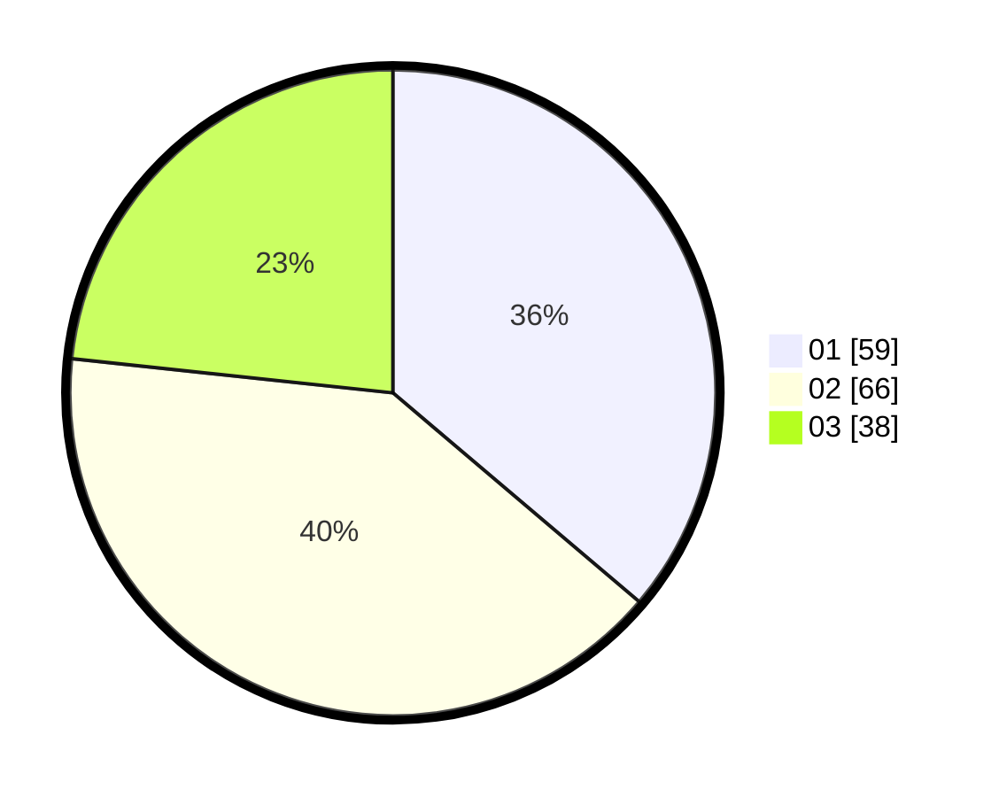

# Hasil

Hasil perolehan suara paslon dapat dilihat pada file paslon-01.txt, paslon-02.txt, dan paslon-03.txt.

Jika tidak ada, artinya data tersebut belum ada pada SIREKAP.

## Perolehan Suara

 * Paslon 01: **59**.
 * Paslon 02: **66**.
 * Paslon 03: **38**.

## Foto C Plano

https://sirekap-obj-formc.kpu.go.id/e986/pemilu/ppwp/31/75/06/10/05/3175061005285-20240214-190559--b56bab0b-cbfe-42a4-9303-ceb611cf2dda.jpg

https://sirekap-obj-formc.kpu.go.id/e986/pemilu/ppwp/31/75/06/10/05/3175061005285-20240214-190613--f4d3d67e-d51c-4c75-9907-731e8f03a58c.jpg

https://sirekap-obj-formc.kpu.go.id/e986/pemilu/ppwp/31/75/06/10/05/3175061005285-20240214-190629--f24ab678-81f2-4b8a-863d-1c8b0bbce69a.jpg

## DATA PEMILIH TETAP

Jumlah pemilih dalam DPT: **209**.
 * L: **103**.
 * P: **106**.

## DATA PENGGUNA HAK PILIH

Jumlah pengguna hak pilih dalam DPT: **161**.
 * L: **79**.
 * P: **82**.

Jumlah pengguna hak pilih dalam DPTb: **3**.
 * L: **1**.
 * P: **2**.

Jumlah pengguna hak pilih dalam DPK: **3**.
 * L: **2**.
 * P: **1**.

Jumlah pengguna hak pilih: **167**.
 * L: **82**.
 * P: **85**.

## JUMLAH SUARA SAH DAN TIDAK SAH

JUMLAH SELURUH SUARA SAH: **163**.

JUMLAH SUARA TIDAK SAH: **4**.

JUMLAH SELURUH SUARA SAH DAN SUARA TIDAK SAH: **167**.
