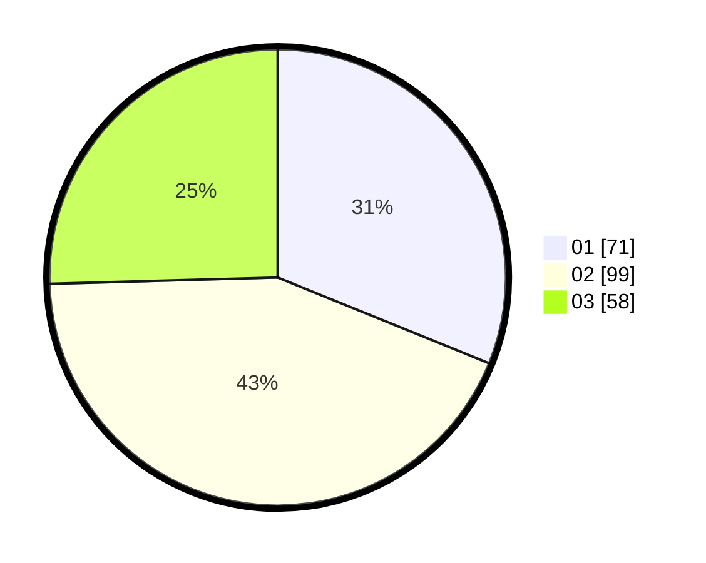

# Hasil

Hasil perolehan suara paslon dapat dilihat pada file paslon-01.txt, paslon-02.txt, dan paslon-03.txt.

Jika tidak ada, artinya data tersebut belum ada pada SIREKAP.

## Perolehan Suara

 * Paslon 01: **71**.
 * Paslon 02: **99**.
 * Paslon 03: **58**.

## Foto C Plano

https://sirekap-obj-formc.kpu.go.id/00bd/pemilu/ppwp/31/75/06/10/05/3175061005289-20240214-194925--24995a9c-a58d-4a70-95d0-569f579c0270.jpg

https://sirekap-obj-formc.kpu.go.id/00bd/pemilu/ppwp/31/75/06/10/05/3175061005289-20240214-194257--d21161f9-d296-4ed0-aa9b-9b4900a18115.jpg

https://sirekap-obj-formc.kpu.go.id/00bd/pemilu/ppwp/31/75/06/10/05/3175061005289-20240214-194357--83f15498-dc16-4733-9725-de51b2bd66eb.jpg

## DATA PEMILIH TETAP

Jumlah pemilih dalam DPT: **282**.
 * L: **130**.
 * P: **152**.

## DATA PENGGUNA HAK PILIH

Jumlah pengguna hak pilih dalam DPT: **226**.
 * L: **102**.
 * P: **124**.

Jumlah pengguna hak pilih dalam DPTb: **5**.
 * L: **1**.
 * P: **4**.

Jumlah pengguna hak pilih dalam DPK: **1**.
 * L: **0**.
 * P: **1**.

Jumlah pengguna hak pilih: **232**.
 * L: **103**.
 * P: **129**.

## JUMLAH SUARA SAH DAN TIDAK SAH

JUMLAH SELURUH SUARA SAH: **228**.

JUMLAH SUARA TIDAK SAH: **4**.

JUMLAH SELURUH SUARA SAH DAN SUARA TIDAK SAH: **232**.
