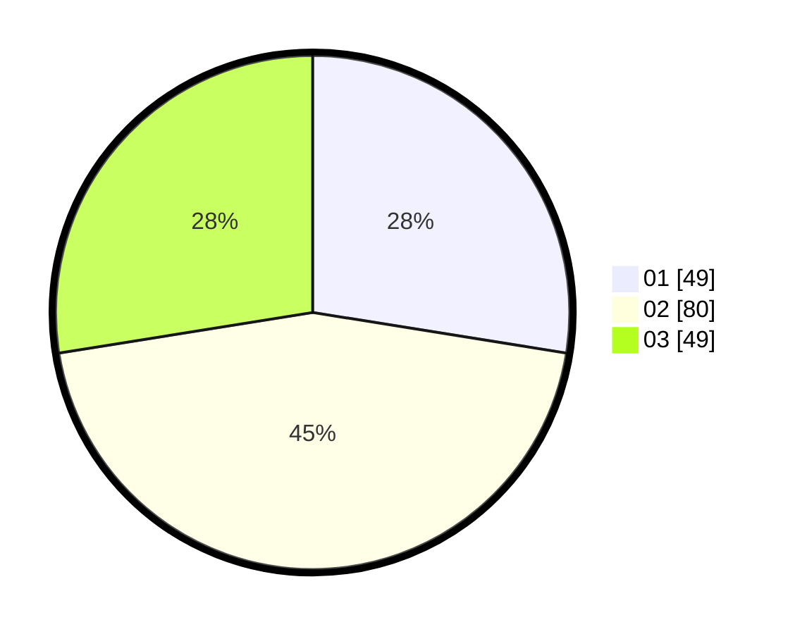

# Hasil

Hasil perolehan suara paslon dapat dilihat pada file paslon-01.txt, paslon-02.txt, dan paslon-03.txt.

Jika tidak ada, artinya data tersebut belum ada pada SIREKAP.

## Perolehan Suara

 * Paslon 01: **49**.
 * Paslon 02: **80**.
 * Paslon 03: **49**.

## Foto C Plano

https://sirekap-obj-formc.kpu.go.id/eaed/pemilu/ppwp/31/75/06/10/05/3175061005296-20240216-132004--c6ecff1f-1db4-47c6-aa03-ea7757209767.jpg

https://sirekap-obj-formc.kpu.go.id/eaed/pemilu/ppwp/31/75/06/10/05/3175061005296-20240214-190145--18ef0206-99d0-43c3-b6f1-a3cb9b21da23.jpg

https://sirekap-obj-formc.kpu.go.id/eaed/pemilu/ppwp/31/75/06/10/05/3175061005296-20240214-190156--fef1adb8-38f4-4b50-977b-ab32f0dfa12b.jpg

## DATA PEMILIH TETAP

Jumlah pemilih dalam DPT: **0**.
 * L: **0**.
 * P: **0**.

## DATA PENGGUNA HAK PILIH

Jumlah pengguna hak pilih dalam DPT: **0**.
 * L: **0**.
 * P: **0**.

Jumlah pengguna hak pilih dalam DPTb: **0**.
 * L: **0**.
 * P: **0**.

Jumlah pengguna hak pilih dalam DPK: **0**.
 * L: **0**.
 * P: **0**.

Jumlah pengguna hak pilih: **0**.
 * L: **0**.
 * P: **0**.

## JUMLAH SUARA SAH DAN TIDAK SAH

JUMLAH SELURUH SUARA SAH: **178**.

JUMLAH SUARA TIDAK SAH: **2**.

JUMLAH SELURUH SUARA SAH DAN SUARA TIDAK SAH: **180**.
