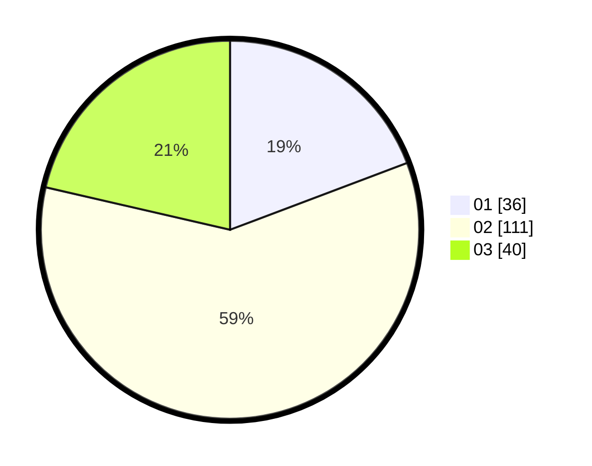

# Hasil

Hasil perolehan suara paslon dapat dilihat pada file paslon-01.txt, paslon-02.txt, dan paslon-03.txt.

Jika tidak ada, artinya data tersebut belum ada pada SIREKAP.

## Perolehan Suara

 * Paslon 01: **36**.
 * Paslon 02: **111**.
 * Paslon 03: **40**.

## Foto C Plano

https://sirekap-obj-formc.kpu.go.id/a403/pemilu/ppwp/31/75/06/10/05/3175061005304-20240214-211427--5128a28f-3851-454c-b447-1e446b9e4d28.jpg

https://sirekap-obj-formc.kpu.go.id/a403/pemilu/ppwp/31/75/06/10/05/3175061005304-20240214-211645--cfa6639d-3ced-42c6-bcad-dfd889025685.jpg

https://sirekap-obj-formc.kpu.go.id/a403/pemilu/ppwp/31/75/06/10/05/3175061005304-20240214-211105--ebd2daee-a248-4e19-978c-f03af74a1a68.jpg

## DATA PEMILIH TETAP

Jumlah pemilih dalam DPT: **217**.
 * L: **102**.
 * P: **115**.

## DATA PENGGUNA HAK PILIH

Jumlah pengguna hak pilih dalam DPT: **190**.
 * L: **87**.
 * P: **103**.

Jumlah pengguna hak pilih dalam DPTb: **0**.
 * L: **0**.
 * P: **0**.

Jumlah pengguna hak pilih dalam DPK: **0**.
 * L: **0**.
 * P: **0**.

Jumlah pengguna hak pilih: **190**.
 * L: **87**.
 * P: **103**.

## JUMLAH SUARA SAH DAN TIDAK SAH

JUMLAH SELURUH SUARA SAH: **187**.

JUMLAH SUARA TIDAK SAH: **3**.

JUMLAH SELURUH SUARA SAH DAN SUARA TIDAK SAH: **190**.
