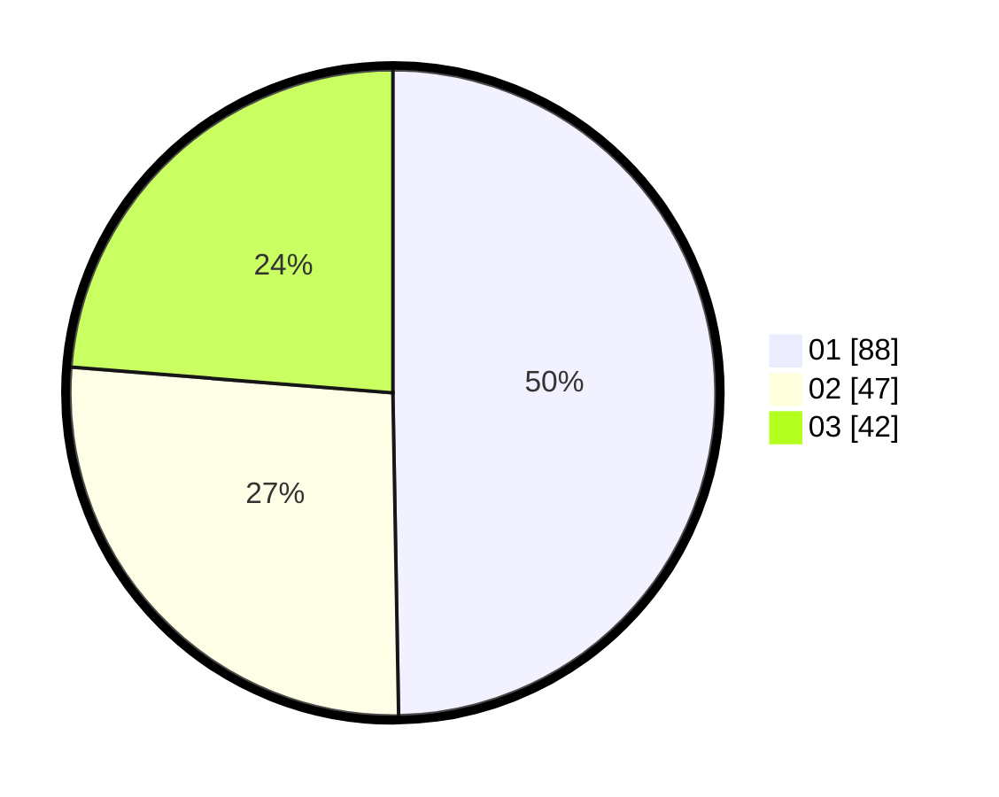

# Hasil

Hasil perolehan suara paslon dapat dilihat pada file paslon-01.txt, paslon-02.txt, dan paslon-03.txt.

Jika tidak ada, artinya data tersebut belum ada pada SIREKAP.

## Perolehan Suara

 * Paslon 01: **88**.
 * Paslon 02: **47**.
 * Paslon 03: **42**.

## Foto C Plano

https://sirekap-obj-formc.kpu.go.id/7bda/pemilu/ppwp/31/75/06/10/05/3175061005308-20240214-194602--a1125ed6-d713-4de1-b8cd-2b341fe074d2.jpg

https://sirekap-obj-formc.kpu.go.id/7bda/pemilu/ppwp/31/75/06/10/05/3175061005308-20240214-194747--c7df5f73-58b5-4154-8eb2-e98faaa15c86.jpg

https://sirekap-obj-formc.kpu.go.id/7bda/pemilu/ppwp/31/75/06/10/05/3175061005308-20240214-194838--37081ce4-65c1-48ff-b355-6d256e829bb3.jpg

## DATA PEMILIH TETAP

Jumlah pemilih dalam DPT: **205**.
 * L: **88**.
 * P: **117**.

## DATA PENGGUNA HAK PILIH

Jumlah pengguna hak pilih dalam DPT: **174**.
 * L: **76**.
 * P: **98**.

Jumlah pengguna hak pilih dalam DPTb: **1**.
 * L: **0**.
 * P: **1**.

Jumlah pengguna hak pilih dalam DPK: **3**.
 * L: **0**.
 * P: **3**.

Jumlah pengguna hak pilih: **178**.
 * L: **76**.
 * P: **102**.

## JUMLAH SUARA SAH DAN TIDAK SAH

JUMLAH SELURUH SUARA SAH: **177**.

JUMLAH SUARA TIDAK SAH: **1**.

JUMLAH SELURUH SUARA SAH DAN SUARA TIDAK SAH: **178**.
