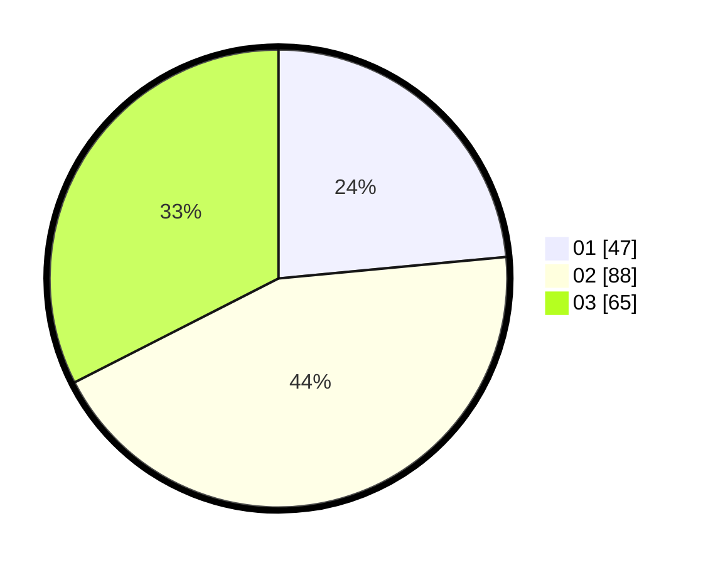

# Hasil

Hasil perolehan suara paslon dapat dilihat pada file paslon-01.txt, paslon-02.txt, dan paslon-03.txt.

Jika tidak ada, artinya data tersebut belum ada pada SIREKAP.

## Perolehan Suara

 * Paslon 01: **47**.
 * Paslon 02: **88**.
 * Paslon 03: **65**.

## Foto C Plano

https://sirekap-obj-formc.kpu.go.id/e885/pemilu/ppwp/31/75/06/10/05/3175061005311-20240214-185455--38c22bec-bd48-4056-bef6-d08029af1cdc.jpg

https://sirekap-obj-formc.kpu.go.id/e885/pemilu/ppwp/31/75/06/10/05/3175061005311-20240214-185612--3b7af0ad-4687-42fc-ac8e-3ae00d8f962e.jpg

https://sirekap-obj-formc.kpu.go.id/e885/pemilu/ppwp/31/75/06/10/05/3175061005311-20240214-185722--90d7e608-65e0-4849-a5e3-8aeb64113b52.jpg

## DATA PEMILIH TETAP

Jumlah pemilih dalam DPT: **237**.
 * L: **116**.
 * P: **121**.

## DATA PENGGUNA HAK PILIH

Jumlah pengguna hak pilih dalam DPT: **183**.
 * L: **88**.
 * P: **95**.

Jumlah pengguna hak pilih dalam DPTb: **7**.
 * L: **6**.
 * P: **2**.

Jumlah pengguna hak pilih dalam DPK: **11**.
 * L: **4**.
 * P: **7**.

Jumlah pengguna hak pilih: **202**.
 * L: **98**.
 * P: **103**.

## JUMLAH SUARA SAH DAN TIDAK SAH

JUMLAH SELURUH SUARA SAH: **200**.

JUMLAH SUARA TIDAK SAH: **1**.

JUMLAH SELURUH SUARA SAH DAN SUARA TIDAK SAH: **201**.
