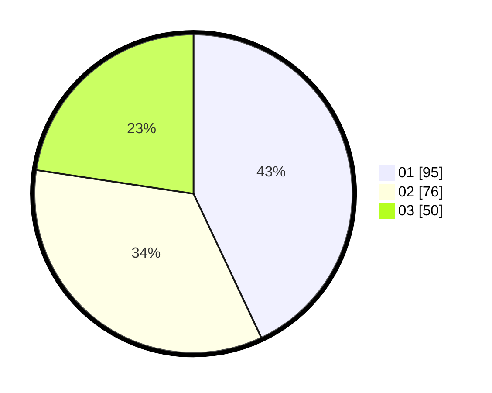

# Hasil

Hasil perolehan suara paslon dapat dilihat pada file paslon-01.txt, paslon-02.txt, dan paslon-03.txt.

Jika tidak ada, artinya data tersebut belum ada pada SIREKAP.

## Perolehan Suara

 * Paslon 01: **95**.
 * Paslon 02: **76**.
 * Paslon 03: **50**.

## Foto C Plano

https://sirekap-obj-formc.kpu.go.id/1c4a/pemilu/ppwp/31/75/06/10/05/3175061005318-20240214-225409--768425a1-4ff6-4415-9a66-15937e15bbcf.jpg

https://sirekap-obj-formc.kpu.go.id/1c4a/pemilu/ppwp/31/75/06/10/05/3175061005318-20240214-225603--cfd7cd9f-c7cf-463e-86f4-2f9a5ebf0d2f.jpg

https://sirekap-obj-formc.kpu.go.id/1c4a/pemilu/ppwp/31/75/06/10/05/3175061005318-20240214-225737--4d1b656c-074c-4c7f-9632-8f2ff8d14c78.jpg
