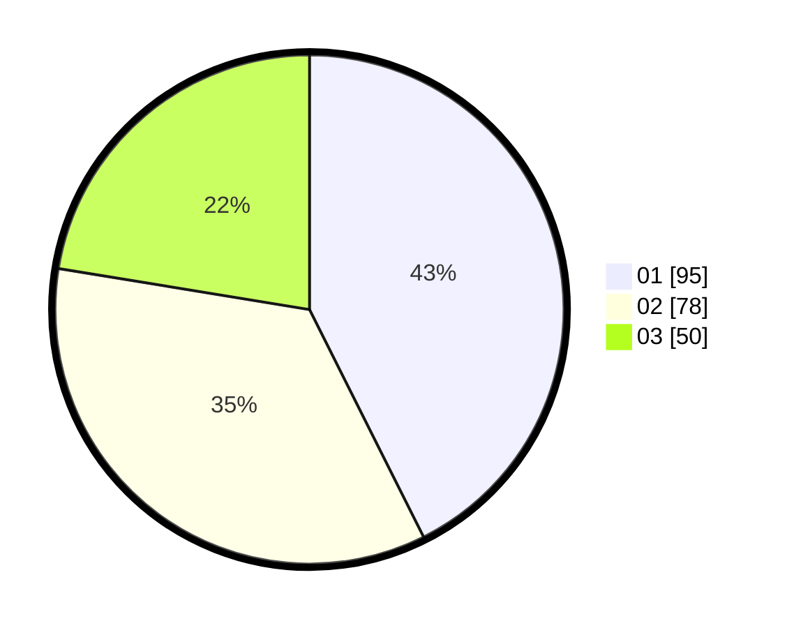

# Hasil

Hasil perolehan suara paslon dapat dilihat pada file paslon-01.txt, paslon-02.txt, dan paslon-03.txt.

Jika tidak ada, artinya data tersebut belum ada pada SIREKAP.

## Perolehan Suara

 * Paslon 01: **95**.
 * Paslon 02: **78**.
 * Paslon 03: **50**.

## Foto C Plano

https://sirekap-obj-formc.kpu.go.id/ba17/pemilu/ppwp/31/75/06/10/05/3175061005322-20240214-190146--1281b0db-261d-4e4f-af8c-0f3067d3aa2d.jpg

https://sirekap-obj-formc.kpu.go.id/ba17/pemilu/ppwp/31/75/06/10/05/3175061005322-20240214-175448--1b9ea82d-2e19-4e97-b1a6-cf26d20ef044.jpg

https://sirekap-obj-formc.kpu.go.id/ba17/pemilu/ppwp/31/75/06/10/05/3175061005322-20240214-185146--abf8cc9f-4258-4e4f-868e-d6957163a90b.jpg

## DATA PEMILIH TETAP

Jumlah pemilih dalam DPT: **283**.
 * L: **140**.
 * P: **143**.

## DATA PENGGUNA HAK PILIH

Jumlah pengguna hak pilih dalam DPT: **224**.
 * L: **111**.
 * P: **113**.

Jumlah pengguna hak pilih dalam DPTb: **5**.
 * L: **4**.
 * P: **1**.

Jumlah pengguna hak pilih dalam DPK: **2**.
 * L: **1**.
 * P: **1**.

Jumlah pengguna hak pilih: **231**.
 * L: **116**.
 * P: **115**.

## JUMLAH SUARA SAH DAN TIDAK SAH

JUMLAH SELURUH SUARA SAH: **223**.

JUMLAH SUARA TIDAK SAH: **8**.

JUMLAH SELURUH SUARA SAH DAN SUARA TIDAK SAH: **231**.
