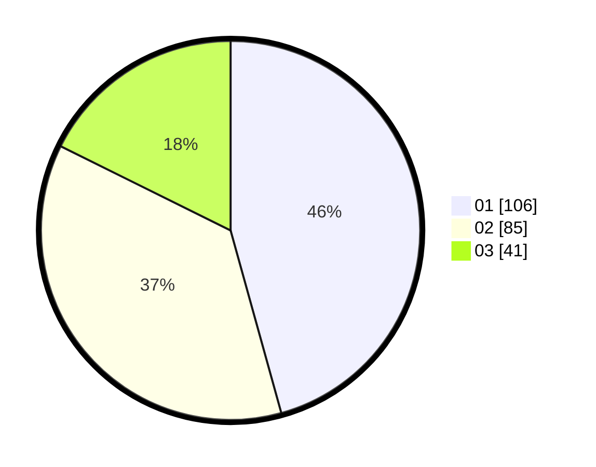

# Hasil

Hasil perolehan suara paslon dapat dilihat pada file paslon-01.txt, paslon-02.txt, dan paslon-03.txt.

Jika tidak ada, artinya data tersebut belum ada pada SIREKAP.

## Perolehan Suara

 * Paslon 01: **106**.
 * Paslon 02: **85**.
 * Paslon 03: **41**.

## Foto C Plano

https://sirekap-obj-formc.kpu.go.id/de70/pemilu/ppwp/31/75/06/10/05/3175061005323-20240214-190431--f5362ed3-e58a-4224-9b45-d6fca5d2892a.jpg

https://sirekap-obj-formc.kpu.go.id/de70/pemilu/ppwp/31/75/06/10/05/3175061005323-20240214-190445--3d925d21-c97c-4ca3-843c-12e33cb8a8ae.jpg

https://sirekap-obj-formc.kpu.go.id/de70/pemilu/ppwp/31/75/06/10/05/3175061005323-20240214-192834--0eb4fbb9-af79-4bf0-b46a-1f6d80763ceb.jpg

## DATA PEMILIH TETAP

Jumlah pemilih dalam DPT: **282**.
 * L: **134**.
 * P: **148**.

## DATA PENGGUNA HAK PILIH

Jumlah pengguna hak pilih dalam DPT: **230**.
 * L: **106**.
 * P: **124**.

Jumlah pengguna hak pilih dalam DPTb: **2**.
 * L: **2**.
 * P: **0**.

Jumlah pengguna hak pilih dalam DPK: **2**.
 * L: **1**.
 * P: **1**.

Jumlah pengguna hak pilih: **234**.
 * L: **109**.
 * P: **125**.

## JUMLAH SUARA SAH DAN TIDAK SAH

JUMLAH SELURUH SUARA SAH: **232**.

JUMLAH SUARA TIDAK SAH: **2**.

JUMLAH SELURUH SUARA SAH DAN SUARA TIDAK SAH: **234**.
