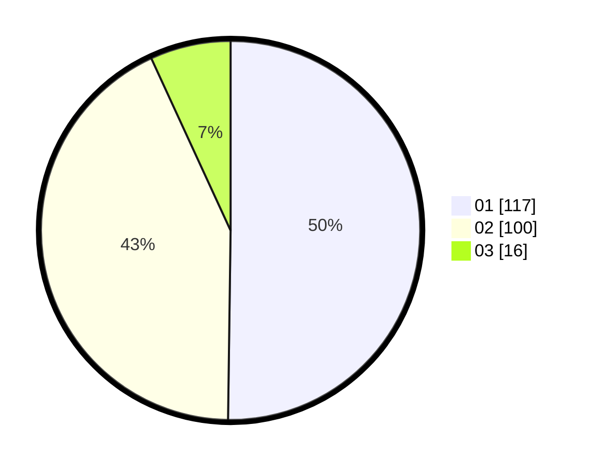

# Hasil

Hasil perolehan suara paslon dapat dilihat pada file paslon-01.txt, paslon-02.txt, dan paslon-03.txt.

Jika tidak ada, artinya data tersebut belum ada pada SIREKAP.

## Perolehan Suara

 * Paslon 01: **117**.
 * Paslon 02: **100**.
 * Paslon 03: **16**.

## Foto C Plano

https://sirekap-obj-formc.kpu.go.id/c6a9/pemilu/ppwp/31/75/06/10/05/3175061005324-20240214-195432--1903aa04-1231-41a4-b746-a102466b1c3f.jpg

https://sirekap-obj-formc.kpu.go.id/c6a9/pemilu/ppwp/31/75/06/10/05/3175061005324-20240214-193207--83d485d2-89b5-4600-8804-b553b581df1f.jpg

https://sirekap-obj-formc.kpu.go.id/c6a9/pemilu/ppwp/31/75/06/10/05/3175061005324-20240214-193257--e38d566f-1f53-4e1a-9cbf-924a1308095a.jpg

## DATA PEMILIH TETAP

Jumlah pemilih dalam DPT: **286**.
 * L: **134**.
 * P: **152**.

## DATA PENGGUNA HAK PILIH

Jumlah pengguna hak pilih dalam DPT: **236**.
 * L: **110**.
 * P: **126**.

Jumlah pengguna hak pilih dalam DPTb: **3**.
 * L: **1**.
 * P: **2**.

Jumlah pengguna hak pilih dalam DPK: **2**.
 * L: **2**.
 * P: **0**.

Jumlah pengguna hak pilih: **241**.
 * L: **113**.
 * P: **128**.

## JUMLAH SUARA SAH DAN TIDAK SAH

JUMLAH SELURUH SUARA SAH: **233**.

JUMLAH SUARA TIDAK SAH: **8**.

JUMLAH SELURUH SUARA SAH DAN SUARA TIDAK SAH: **241**.
