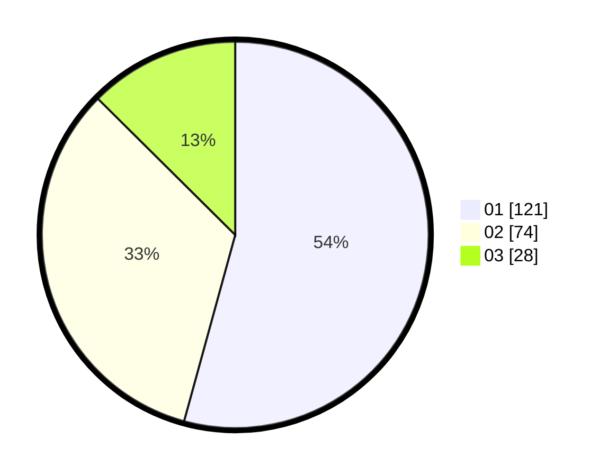

# Hasil

Hasil perolehan suara paslon dapat dilihat pada file paslon-01.txt, paslon-02.txt, dan paslon-03.txt.

Jika tidak ada, artinya data tersebut belum ada pada SIREKAP.

## Perolehan Suara

 * Paslon 01: **121**.
 * Paslon 02: **74**.
 * Paslon 03: **28**.

## Foto C Plano

https://sirekap-obj-formc.kpu.go.id/369c/pemilu/ppwp/31/75/06/10/05/3175061005325-20240214-155014--ffee2c23-95a9-4e34-ae40-943bac9957c6.jpg

https://sirekap-obj-formc.kpu.go.id/369c/pemilu/ppwp/31/75/06/10/05/3175061005325-20240215-181131--e4d341ba-2b31-485d-a895-8a7ba7f30bd4.jpg

https://sirekap-obj-formc.kpu.go.id/369c/pemilu/ppwp/31/75/06/10/05/3175061005325-20240214-155053--3d7ea42d-4a6a-44f9-a522-8e5f950f6c37.jpg

## DATA PEMILIH TETAP

Jumlah pemilih dalam DPT: **283**.
 * L: **130**.
 * P: **153**.

## DATA PENGGUNA HAK PILIH

Jumlah pengguna hak pilih dalam DPT: **221**.
 * L: **101**.
 * P: **120**.

Jumlah pengguna hak pilih dalam DPTb: **3**.
 * L: **2**.
 * P: **1**.

Jumlah pengguna hak pilih dalam DPK: **2**.
 * L: **2**.
 * P: **0**.

Jumlah pengguna hak pilih: **226**.
 * L: **105**.
 * P: **121**.

## JUMLAH SUARA SAH DAN TIDAK SAH

JUMLAH SELURUH SUARA SAH: **223**.

JUMLAH SUARA TIDAK SAH: **3**.

JUMLAH SELURUH SUARA SAH DAN SUARA TIDAK SAH: **226**.
