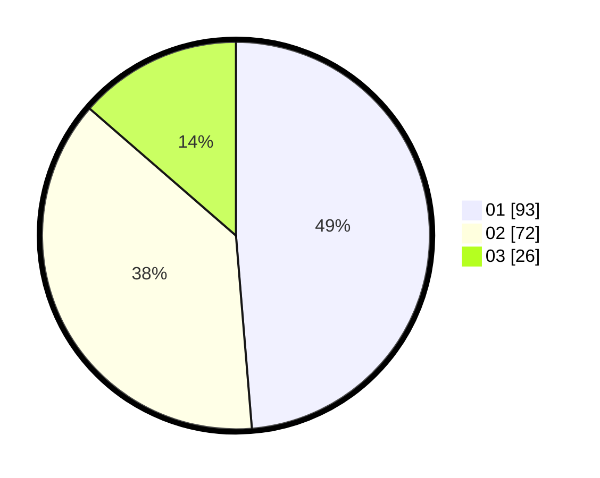

# Hasil

Hasil perolehan suara paslon dapat dilihat pada file paslon-01.txt, paslon-02.txt, dan paslon-03.txt.

Jika tidak ada, artinya data tersebut belum ada pada SIREKAP.

## Perolehan Suara

 * Paslon 01: **93**.
 * Paslon 02: **72**.
 * Paslon 03: **26**.

## Foto C Plano

https://sirekap-obj-formc.kpu.go.id/214e/pemilu/ppwp/31/75/06/10/05/3175061005332-20240214-225805--06dca4ec-eaf7-439e-afbf-60d49b0b4be4.jpg

https://sirekap-obj-formc.kpu.go.id/214e/pemilu/ppwp/31/75/06/10/05/3175061005332-20240214-225818--fc9dcdf2-093c-4f00-8de5-4792355c0b2d.jpg

https://sirekap-obj-formc.kpu.go.id/214e/pemilu/ppwp/31/75/06/10/05/3175061005332-20240214-225824--2145acd7-35d0-4533-9983-1a8b05f6ca91.jpg

## DATA PEMILIH TETAP

Jumlah pemilih dalam DPT: **238**.
 * L: **119**.
 * P: **119**.

## DATA PENGGUNA HAK PILIH

Jumlah pengguna hak pilih dalam DPT: **193**.
 * L: **91**.
 * P: **102**.

Jumlah pengguna hak pilih dalam DPTb: **0**.
 * L: **0**.
 * P: **0**.

Jumlah pengguna hak pilih dalam DPK: **0**.
 * L: **0**.
 * P: **0**.

Jumlah pengguna hak pilih: **193**.
 * L: **91**.
 * P: **102**.

## JUMLAH SUARA SAH DAN TIDAK SAH

JUMLAH SELURUH SUARA SAH: **191**.

JUMLAH SUARA TIDAK SAH: **2**.

JUMLAH SELURUH SUARA SAH DAN SUARA TIDAK SAH: **193**.
