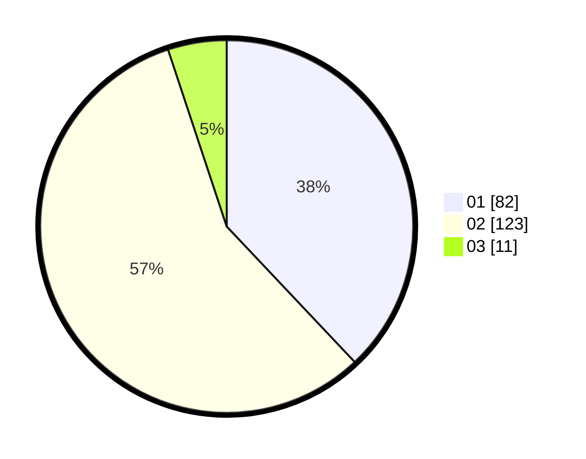

# Hasil

Hasil perolehan suara paslon dapat dilihat pada file paslon-01.txt, paslon-02.txt, dan paslon-03.txt.

Jika tidak ada, artinya data tersebut belum ada pada SIREKAP.

## Perolehan Suara

 * Paslon 01: **82**.
 * Paslon 02: **123**.
 * Paslon 03: **11**.

## Foto C Plano

https://sirekap-obj-formc.kpu.go.id/8597/pemilu/ppwp/31/75/06/10/05/3175061005335-20240214-194814--28cf44fa-953f-4075-ac11-9fd158916316.jpg

https://sirekap-obj-formc.kpu.go.id/8597/pemilu/ppwp/31/75/06/10/05/3175061005335-20240214-194830--341890e6-a91a-4835-a129-2e5c961b1d08.jpg

https://sirekap-obj-formc.kpu.go.id/8597/pemilu/ppwp/31/75/06/10/05/3175061005335-20240214-194835--6f277d5a-287f-4ee0-9de6-2c4e94a0d67e.jpg

## DATA PEMILIH TETAP

Jumlah pemilih dalam DPT: **266**.
 * L: **129**.
 * P: **137**.

## DATA PENGGUNA HAK PILIH

Jumlah pengguna hak pilih dalam DPT: **214**.
 * L: **104**.
 * P: **110**.

Jumlah pengguna hak pilih dalam DPTb: **0**.
 * L: **0**.
 * P: **0**.

Jumlah pengguna hak pilih dalam DPK: **4**.
 * L: **2**.
 * P: **2**.

Jumlah pengguna hak pilih: **218**.
 * L: **106**.
 * P: **112**.

## JUMLAH SUARA SAH DAN TIDAK SAH

JUMLAH SELURUH SUARA SAH: **216**.

JUMLAH SUARA TIDAK SAH: **2**.

JUMLAH SELURUH SUARA SAH DAN SUARA TIDAK SAH: **218**.
